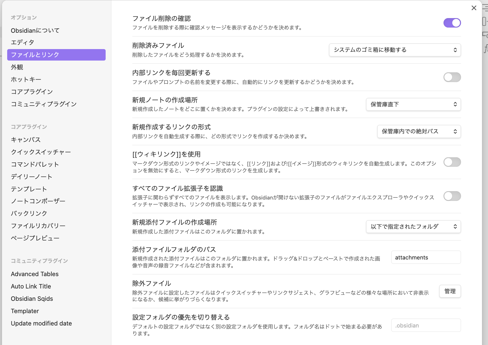

## 目指すかたち
- 書く作業に集中できる環境の実現
  - 画像は本文にドラッグ&ドロップだけで完結
  - Markdownで書いて将来の移植性を確保
  - URLは短く読みやすい形式を維持し、リンク切れを防ぐ
- メンテナンスの容易性
  - フレームワークやライブラリの機能を活用して少ないコード量で十分な機能
  - 依存関係をシンプルに保ち、トラブル時の切り分けを容易に
- 低コストでの運用
  - 月額300円以下を目標に
  - 無料枠の制限に配慮した設計
## 構成

| 項目         | サービス                                                                                                                  |
| ---------- | --------------------------------------------------------------------------------------------------------------------- |
| 執筆環境       | [Obsidian](https://obsidian.md)                                                                                       |
| サイトジェネレーター | [Astro](https://astro.build)                                                                                          |
| コンテンツ管理    | [Github](https://github.com)                                                                                          |
| ホスティング     | [Cloudflare Pages](https://www.cloudflare.com/ja-jp/developer-platform/products/pages/)                               |
| ドメイン       | [Cloudflare DNS](https://www.cloudflare.com/ja-jp/application-services/products/dns/), [Porkbun](https://porkbun.com) |
#### 執筆フロー
✍️ Obsidian → 👍 Github push → ⚙️ Cloudflare Pages build & deploy → ✅ Publish
#### ローカル確認環境
✍️ VSCode → 🚀 Astro $ npm run dev → ✅ localhost:4321
## 選定背景
### Webフロントエンドフレームワークの選択
#### アーキテクチャの選択: なぜSSGなのか
WordPress のようなSSR、Astro のようなSSG、React ベースのSPAの3つの選択肢を検討しました。

まずSSRについて、WordPress や Django は動的なコンテンツ生成が容易な反面、サーバーの継続的なメンテナンスが必要です。「メンテナンスの容易性」という観点から、この選択肢は見送りました。

React とそのエコシステムなどのSPAは、Webアプリケーション向けの機能が豊富です。ゆえに単純なブログコンテンツの配信には不要な機能も多く、オーバースペックだと判断しました。

最終的にSSGを採用することにしました。サーバーレスで運用でき、CDN配信との相性も良好です。ビルドは Cloudflare Pages 側で実行されるので、たとえビルド時間が長くなったとしても執筆プロセスへの影響はありません。
#### SSGの中でAstroを選んだ理由
SSGの選定では、Markdown のネイティブサポートを重視しました。非公式のプラグインによる対応では、メンテナンス性に不安が残るためです。

Hugo や Gatsby も検討しましたが、テーマへの依存度が気になりました。カスタマイズの自由度を考えると、必要な機能を積み上げていける方が良さそうです。

また、普段から Svelte を使用しているので、Astro の開発体験は馴染み深いものでした。Island Architecture によるコンポーネントの組み込みや、node package の扱いを含めた開発フローが自然な形で構築できそうだと考えています。

|  **フレーム<br>ワーク**  | **SPA/<br>MPA** | **SSG/<br>SSR** | **初回<br>ロード** | **ページ<br>遷移** | **.md**     | **lang** | **サーバ<br>メンテ** | **例** |
| :---------------: | --------------- | --------------- | ------------- | ------------- | ----------- | -------- | -------------- | ----- |
| **Hugo, Gatsby**  | MPA             | SSG             | +             | ++            | **Builtin** | Go, JS   | 不要             | 沢山    |
|     **Astro**     | MPA             | SSG             | +             | ++            | **Builtin** | JS/TS    | 不要             | 新興    |
|    **Svelte**     | SPA*            | SSG*            | +++           | +             | Plugin      | JS/TS    | 構成             | 新興    |
|  **React, Vue**   | SPA*            | SSG*            | +++           | +             | Plugin      | JS/TS    | 構成             | 沢山    |
|    **Angular**    | SPA*            | SSG*            | +++           | +             | Plugin      | TS       | 構成             | ？     |
| **Django, Flask** | MPA             | SSR             | ++            | +++           | ？           | Python   | 必要             | レア    |
|   **WordPress**   | MPA             | SSR             | ++++          | ++++          | Plugin      | PHP      | 必要             | 沢山    |
|    **Drupal**     | MPA*            | SSR*            | ++            | +++           | Plugin      | PHP      | 必要             | デジ庁   |

**記号凡例**:
`*`: 例えば、SPAが基本だが、拡張機能でMPAもできるなど、基本構成以外の実装も可能なことを示す
`+`: ロード時間の感覚的な印象。+が多いほど時間がかかる（あくまで個人的な体感）

### 執筆環境の選択: なぜObsidianなのか
コンテンツ管理の選択肢としては、Notion のような All in One のサービスや、最近人気のある headless CMS ( Newt や microCMS ) を検討しました。

Notion は Markdown エクスポートも可能で書き心地も良いのですが、オフライン執筆ができないことが気になります。またAPIを介したコンテンツ取得が必要で、ビルドの依存関係や複雑さが増えてしまうことも、「メンテナンスの容易性」という観点には合致しませんでした。

microCMS や Newt などの headless CMS はここ数年定着してきており魅力的です。ただし個人ブログでの利用ではフリープランの制限にすぐ引っかかりそうで、運用コストの目安を外れてしまいます。また Markdown のエクスポートは可能とはいえ、画像の管理まで含めると移行の手間は残りそうです。

結果的にObsidianを選択したのは、以下の理由からです：
- ローカルの Markdown ファイルをそのままGitで管理できる
- 画像のドラッグ&ドロップで自動で適切なフォルダに配置される
- プラグインで足りない機能を補完できる（フロントマターの自動更新など）

### ホスティングの選択: なぜCloudflare Pagesなのか
静的サイトのホスティング先として、Vercel、Netlify、GitHub Pages、Cloudflare Pages を比較検討しました。

Vercelは無料プランでの商用利用に制限があります。個人ブログとはいえ、将来的な制約は避けたいところです。
Netlifyは充実した機能と実績がある一方で、ホスティングサーバーが遠いという話をよく耳にします [^1]。CDNは効くものの、その前段の応答が気になりました。
GitHub Pages はシンプルで安定していますが、デプロイフローを自前で構築する必要があります。CIの設定など、本質的でない部分に時間を取られそうでした。

最終的に Cloudflare Pages を選んだ決め手は次の通りです：
- 帯域制限がない（他サービスは100GB/月程度）
- GitHub との連携による自動デプロイが安定している
- エッジロケーションの多さ
- 以前個人的に使用した実績があった

[^1]: [Cloudflare Pages・Vercel ・Netlify の違いや使い分けをまとめる](https://zenn.dev/catnose99/scraps/6780379210136f)

## Obsidianの設定
**オプション > ファイルとリンク** から
- **新規ノートの作成場所**: 保管庫直下
  Astroの参照と合わせる
- **新規生成するリンクの形式**: 保管庫内の絶対パス
  画像のリンクがAstroで読める形になる
- **新規添付ファイルの作成場所**: 以下で指定されたフォルダ `_image`
  画像が入る適当なサブフォルダ。アンダーバーをつけておくとAstroのビルドに良い

## Astroのフォルダ構成
```
project-root //必須configファイル等はこのtreeから省略
├── public: 未使用
├── src
│   ├── components //動かなくなったら切り捨てればよい機能
│   │   ├── Link-copy-button.svelte //with svelte-copy
│   │   └── QR-card*.{svelte, ts} //with html-to-image
│   ├── content
│   │   ├── config.ts //collectionのtype設定
│   │   └── note //obsidianのvault
│   │       ├── .obridian //Squid(custom)はpluginフォルダからシムリンク
│   │       ├── _images //記事の画像はここに配置
│   │       ├── _template
│   │       │   └── note.md //with Templater & Squid(custom)
│   │       └── notes*.md //ここでnoteを書く
│   ├── lib //動かないと困る機能
│   │   └── note.ts //noteに関わる関数
│   ├── layouts
│   │   └── Layout.astro //ページのlayout
│   ├── pages
│   │   ├── index.astro //トップページ
│   │   └── note
│   │       └── [id].astro //noteページ
│   └── styles
│       └── global.css
├── tailwind.config.mjs //最低限→残りはglobal.css
├── astro.config.mjs //プラグインの登録など
└── tsconfig.json //noteフォルダの除外
```

## 依存ライブラリ
### Astro関連
- [Tailwind CSS](https://tailwindcss.com):
UIの構築に使用。モックアップ作成が素早くできる反面、後からのリファクタリングは慎重に行う必要がある。
- [@tailwindcss/typography, prose](https://tailwindcss.com/docs/plugins#typography): 
Markdownコンテンツのスタイリングに使用。スタイリングの整形は、実は結構大変な作業になるが、`prose`クラスで簡単にきれいなタイポグラフィを実現できる。
- [Astro Icon](https://www.astroicon.dev): 
アイコンライブラリ。一部不具合があり、Lucide Svelteと併用中。
- [Lucide Svelte](https://lucide.dev/guide/packages/lucide-svelte): 
Svelteベースのアイコンライブラリ。Svelte連携するとAstroコンポーネント内でも利用可能。ただし読み込みタイミングが良くない可能性がある。
- [Svelte](https://svelte.jp): 
Astroアイランド経由で、URLのCopyボタンや、QRカード生成に利用。Svelteのような他のJSフレームワークを組み込めるのはAstroの強みだが、フォント参照でコンクリフトを起こしたように、統合できるゆえの不安定さもある。
### Markdown拡張
- [Expressive Code](https://expressive-code.com/installation/#astro): 
コードブロックにコピーボタンを追加。Astro標準のコードブロックより機能が充実している。
### QRカード機能
- [node-qrcode](https://github.com/soldair/node-qrcode): 
QRコードの生成に使用。
- [html-to-image](https://github.com/bubkoo/html-to-image): 
QRカード全体をイメージとして保存する機能に使用。Firefox環境での互換性に課題あり。
- [SVG in HTML](https://www.w3.org/TR/SVG2/): 
QRカードのレイアウトに使用。ただし一部のプラグインとの相性に注意が必要そう。
### Obsidianプラグイン
- [Update frontmatter modified date  (obsidian-frontmatter-modified-date)](https://github.com/alangrainger/obsidian-frontmatter-modified-date): 
ファイルの実際の編集作業を検知して発火し、更新日時を自動更新する。[Update time on edit plugin (update-time-on-edit-obsidian)](https://github.com/beaussan/update-time-on-edit-obsidian) はファイルのメタ情報の変更時刻を見ているらしい。
- [Templater](https://github.com/SilentVoid13/Templater): 
新規ノート作成時のフロントマター自動生成に使用。日付やIDの挿入を自動化。
- Obsidian [Sqids](https://sqids.org/ja): 
記事のID生成に使用。短くユニークなIDを生成可能。カスタムプラグインとして呼び出している。
- [Auto Link Title](https://github.com/zolrath/obsidian-auto-link-title): 
URLペースト時にタイトルを自動取得する。執筆環境が良くなる。
- [Advanced Tables](https://github.com/tgrosinger/advanced-tables-obsidian): 
Markdownテーブルの作成と編集を支援し、表の整形が自動化される。執筆環境が良くなる。

## 覚えておくこと
### URLの設計思想
記事のURLをどう設計するかは、長期に渡って影響する重要な決定です。

| 要素   | URLに含める場合                                                            | URLに含めない場合                                       |
| ---- | -------------------------------------------------------------------- | ------------------------------------------------ |
| タイトル | ✅ 内容が一目瞭然<br>✅ SEOに有利？<br>🤔 タイトル変更で乖離<br>🤔 日本語だとURLが長くなる           | ✅ ユニークで永続的なリンク<br>✅ 短いURL<br>🤔 内容の推測が難しい        |
| 日付   | ✅ 時系列が分かりやすい<br>✅ アーカイブ構造が自然<br>🤔 作成日or更新日の選択が必要<br>🤔 更新しても古い記事と誤解 | ✅ コンテンツを日付で判断されない<br>✅ シンプルなURL<br>🤔 時系列の把握が難しい |

検討の結果、リンクの永続性・URLの短さ・コンテンツの寿命を日付に依存させないことの3つを重視して、URLにはタイトルも日付も含めない設計を選択しました。
時系列の表示管理はフロントエンドで制御し、更新履歴はGitで追跡できます。
#### IDの生成ルール（Squid）
記事のID（記事のパス）の生成には [Squid](https://sqids.org/ja) を採用しました。
具体的な設定は以下のとおりです：
1. Unix timestamp の先頭10桁を使用（ミリ秒は省略）
2. Squid でエンコード
3. Z-Base-32 の文字セットに制限（口頭で伝えやすくするために大文字小文字の混在を避ける目的で）

これにより `py647x8n` のような8文字程度の短いIDが生成されます。
### 公開制御の仕組みとルール
記事の公開制御は3段階で実装：
1. `_draft`フォルダ内のファイルは`.gitignore`で除外
2. ファイル名先頭の`✏️`マークのファイルも`.gitignore`で除外
3. フロントマターの`public: false`でビルドから除外

つまり、`public: true`かつファイル名に`✏️`がなく、`_draft`フォルダ外にあるファイルのみが公開されます。
### QRカード機能の目的
スマートフォンの写真アプリは、実は優れたブックマーク管理ツールになる可能性があります。例えば、読んだ本の気になるページをスキャンして写真に収めておくことはよくある使い方です。この発想を Web ページの管理にも応用できないかと考えました。

QRカード機能は、Webページへのリンクを写真として保存することを実現します。QRコードを含む画像を生成することで、写真アプリ上で紙の書籍スキャンと一緒にWebページも管理できます。さらに、写真アプリの画像内テキスト検索を使えば、保存したページの内容も検索可能です。スマートフォンからはQRコードを直接タップしてページを開けるため、実用的なブックマークとして機能するはずです。
#### 実装の詳細
1. node-qrcode でQRコードを生成
2. html-to-image でカード全体を画像化
3. ※ Firefox環境での問題あり（今後の課題）

## 今後に持ち越しの課題
- shikiのコードハイライトはexcel-formulaが標準にない、prismはある
- html-to-imageがFirefoxで失敗する
- Svelteのファイル多いよ警告
- astro-iconが特定の条件下で表示されない
- ページネーション、タグページの実装（記事数が10件を超えたら）
- 脚注がジャンプしない
- Cloudflare Pages build が失敗したときの通知
	- Timezone設定
	- キャッシュ設定