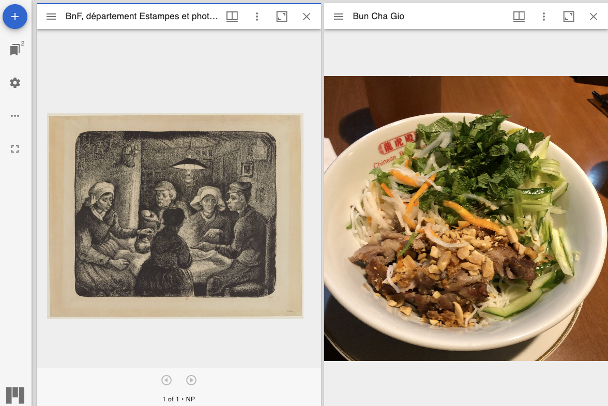
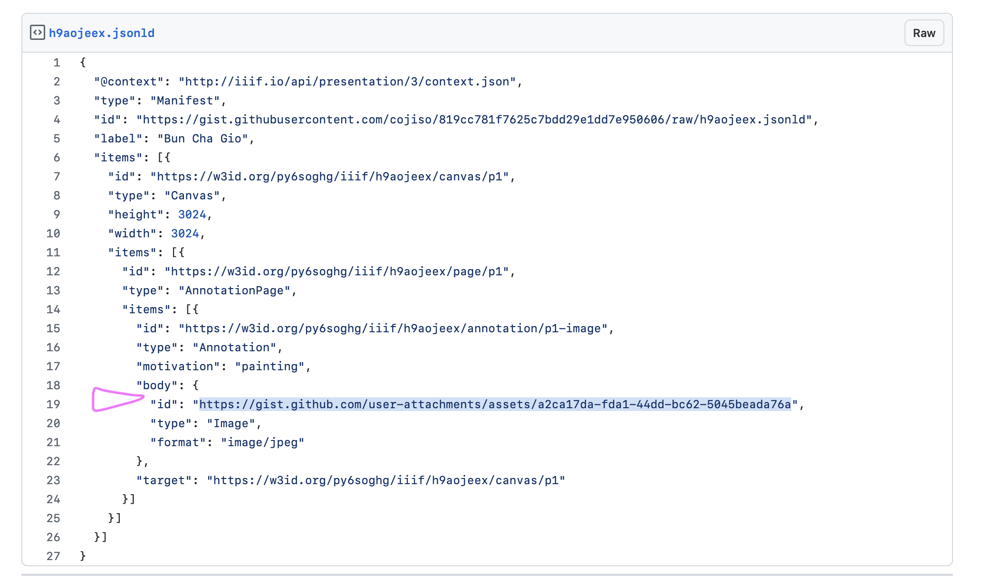
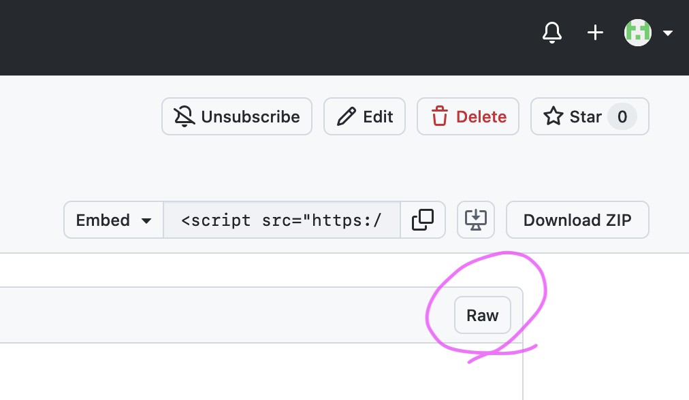
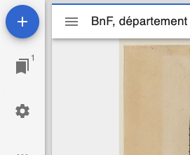
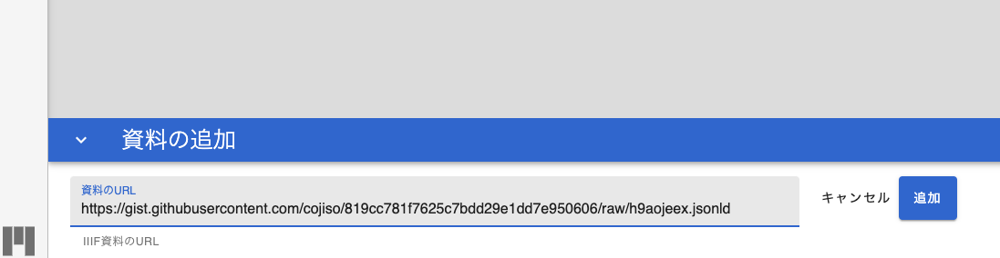
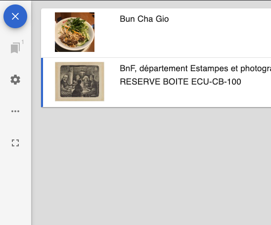
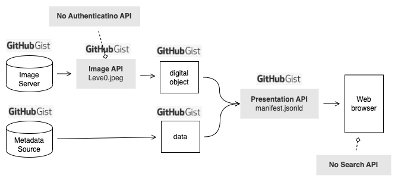
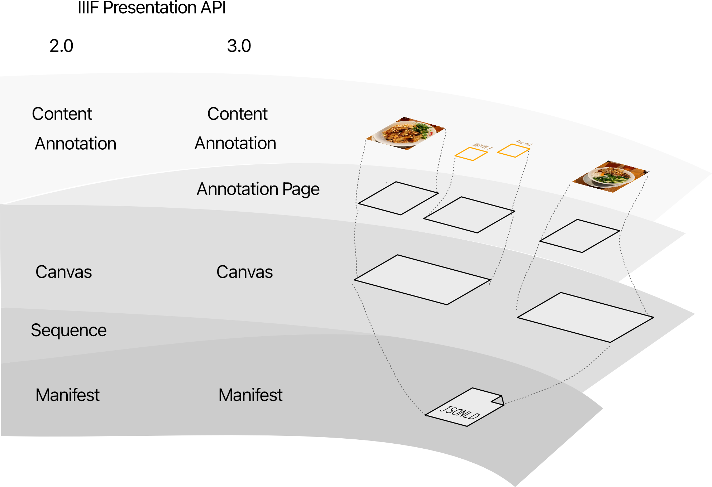

## はじめに
IIIF（International Image Interoperability Framework）は、デジタル画像を標準化された方法で共有、表示、注釈付けするための国際的な規格です。このフレームワークを使用することで、異なる機関が所蔵する画像を共通インターフェースから統一的に扱い、比較や分析を行うことが容易になります。
### 目標
- IIIFの基本的なプロトコルを手を動かして実践的に理解する
- ゴッホの絵の隣にお手持ちのラーメン画像(ラーメンでなくても良い)を表示する
- 10〜30分程度で完了できる hands-on 体験
  

## 準備するもの
- Githubアカウント（Gistを利用します）
- ラーメン画像2,3枚（または任意の画像）
- メモ帳やコードエディタ
## 手順
### 1. 画像の準備
1. [Github Gist](https://gist.github.com)にアクセスし、新しいマークダウンファイル `ANY_NAME_HEAE.md` を作成する
2. 画像をコピー＆ペーストで貼り付ける [^1]
3. ==Create secret gist== をクリックして保存
4. 生成された画像のURLを手元のエディタに控えておきます
[^1]: [Adding Images to markdown files in Gist.markdown · GitHub](https://gist.github.com/kannankumar/4c613cac6d9db896062a16e1cc57d3e5)
### 2. Manifestファイルの準備
1. 新しいJsonLDファイル `ANY_NAME_HEAE.jsonld` を作成
2. [見本のマニフェストファイル](https://gist.github.com/cojiso/819cc781f7625c7bdd29e1dd7e950606)の内容をコピーして貼り付け
```jsonld
{
  "@context": "http://iiif.io/api/presentation/3/context.json",
  "type": "Manifest",
  "id": "https://gist.githubusercontent.com/cojiso/819cc781f7625c7bdd29e1dd7e950606/raw/h9aojeex.jsonld",
  "label": "Bun Cha Gio",
  "items": [{
    "id": "https://w3id.org/py6soghg/iiif/h9aojeex/canvas/p1",
    "type": "Canvas",
    "height": 3024,
    "width": 3024,
    "items": [{
      "id": "https://w3id.org/py6soghg/iiif/h9aojeex/page/p1",
      "type": "AnnotationPage",
      "items": [{
        "id": "https://w3id.org/py6soghg/iiif/h9aojeex/annotation/p1-image",
        "type": "Annotation",
        "motivation": "painting",
        "body": {
          "id": "https://gist.github.com/user-attachments/assets/a2ca17da-fda1-44dd-bc62-5045beada76a",
          "type": "Image",
          "format": "image/jpeg"
        },
        "target": "https://w3id.org/py6soghg/iiif/h9aojeex/canvas/p1"
      }]
    }]
  }]
}
```
4. 以下の画像で示す位置にあるURLを、手順1-4 で控えたURLに書き換えます
   
5. ==Create secret gist== をクリックして保存
6. ==RAW==ボタンをクリックしたあと、ブラウザのアドレスバーに表示されたURLを控えます
   
### 3. IIIFビューワーへの表示
1. [Mirador](https://da.dl.itc.u-tokyo.ac.jp/portal/libraries/mirador/mirador.html?manifest=https://gallica.bnf.fr/iiif/ark:/12148/btv1b105020015/manifest.json) を開きます
2. 左上の ==＋== ボタンをクリック
   
3. ==資料のURL== 欄に 手順2-5 で控えたURLを貼り付け
  
4. エラーがないことを確認し ==×== ボタンを押します
  
5. メイン画面に戻り、画像が表示されたことを確認します 🎉
  
## 技術解説
### IIIFフレームワークの基本構造

IIIFは以下の6つのAPIで構成されています[^5]：

1. **Image API**: 画像の配信に関する規格
2. **Presentation API**: 画像の表示方法や構造を定義
3. **Authentication API**: 認証に関わる規格
4. **Content Search API**: 検索に関わる規格
5. **Change Discovery API**: 変更点を配信するための規格
6. **Content State API (draft)**: Presentation API (Manifestファイル) を参照するための規格

今回のチュートリアルでは、主に Presentation API と Image API を扱いました。

[^5]: [IIIF概説 - ブログ | S2ファクトリー株式会社](https://www.s2factory.co.jp/blog/iiif/)
### 構成の解説
- 
  cf. [EDM to IIIF Manifest Creation | Europeana](https://europeana.moocit.fr/courses/course-v1:europeana+IIIF_EDM01+2024_Q2/about) の図を書き起こして加筆
-  今回は Presentation API の mainfest.jsonld ファイルを手で記述した。
- IIIF Viewer は [Mirador](https://projectmirador.org) を利用。
- Image API は level 0 準拠のものを Gist で近似した。より  level が高い場合にはタイル画像TIFFをJsonで配信する必要があるが、jpeg画像をそのまま配信するだけでもビューワーによっては表示することができる。[^2]
- つまり、もし既に画像を公開済みであれば、そのソースを示すマニフェストファイルを作成するだけで IIIF Viewer に表示することができ、一応は IIIF 対応を達成できるということになる。実際の場面では、最初の公開から高級なLevelに対応するのではなく、Level0 から公開を始め、次第に機能を増やしていく戦略も選択肢になりえる。[^7]

[^2]: [IIIFマニフェストの賞味法 \[28\] 非IIIF対応ソースをIIIFビューアで利用する (1)](https://www.kanzaki.com/works/2018/pub/0125kda.html#s28)
[^7]: 麺とスープだけでも、追加でトッピングを加えても、同じメニューと認識される。まさにラーメンのトッピングのようです。
### マニフェストファイルの解説
- IIIF Presentation API で定義されるマニフェストファイルは以下の階層構造を持つ
	- **Manifest**: 実体としてはJsonldファイルを示す。
	- **Sequence**: バージョン3.0で廃止された。よく分からない。
	- **Canvas**: 体験的には書物のページに近い。ビューワーにおいてページ送りする対象はこの要素。
	- **Annotation Page**: 複数のAnnotationをまとめる作用がある。動画の字幕Annotationを整理する際などに特に役立つ。ビューワー側の体験がまだ最適化されていない。
	- **Annotation**: 画像、注釈、字幕、範囲指定などのコンテンツ。複数の Annotation を視覚的に重ねることで情報を付加していくイメージ。
- また、IIIF Presentation API はバージョン2.0から3.0に切り替わる際に、いくつかのプロパティが互換性を失うことを含む、大幅な変更が行われた。[^3] ビューワーによっては3.0に対応していないものもある。 [^6] 
- - 
- 今回は Content のURI部分のみを書き換えたが、本来は全ての id (URI) を適切に書き換えてユニークにする必要がある。ただしビューワーの実装がまちまちのため、今回のようにContent部分だけを書き換えたファイルも許容して動かせるビューワーもある。
   
[^3]: [CA1989 – 動向レビュー：IIIFの概要と主要APIバージョン3.0の公開 / 永崎研宣 | カレントアウェアネス・ポータル](https://current.ndl.go.jp/ca1989)
[^6]: [セルフミュージアム, Cultural Japan](https://self-museum.cultural.jp) は3.0に対応していない (2024.12.03)
### 次のステップ
- IIIF image api Level3の作成: 別ノートで解説
- アノテーション機能の利用などより複雑なマニフェストファイルの作成: Github

## 参考

### Presentation (image) API
- [CA1989 – 動向レビュー：IIIFの概要と主要APIバージョン3.0の公開 / 永崎研宣 | カレントアウェアネス・ポータル](https://current.ndl.go.jp/ca1989)
- [Presentation API 2.0 — IIIF | International Image Interoperability Framework](https://iiif.io/api/presentation/2.0/)
- [Presentation API 3.0 — IIIF | International Image Interoperability Framework](https://iiif.io/api/presentation/3.0/)
### 学習コース
- [Simplest Manifest - Single Image File — IIIF | International Image Interoperability Framework](https://iiif.io/api/cookbook/recipe/0001-mvm-image/)
- [IIIF Manifestを書く:会津日新館細江図を題材に #JSON-LD - Qiita](https://qiita.com/yegusa/items/9ffbe130a475f1d1aec1)
- [EDM to IIIF Manifest Creation | Europeana](https://europeana.moocit.fr/courses/course-v1:europeana+IIIF_EDM01+2024_Q2/about)
- [Introduction · IIIF Online Workshop](https://training.iiif.io/dhsi/)
### IIIFビューワー
- [IIIF Viewers — IIIF | International Image Interoperability Framework](https://iiif.io/get-started/iiif-viewers/)
- [さまざまなViewerを活用する | 東京学芸大学教育コンテンツアーカイブ](https://d-archive.u-gakugei.ac.jp/viewer#mirador)
- [IIIF対応ビューワの使い方 | 東京大学附属図書館](https://www.lib.u-tokyo.ac.jp/ja/library/contents/archives-top/iiif_manual)
### IIIFツール
- [IIIF Manifest Editor](https://manifest-editor.digirati.services/), マニフェストエディタ
- [Presentation API Validator — IIIF | International Image Interoperability Framework](https://iiif.io/api/presentation/validator/service/), 文法の正しさをチェックできる。実は今回のファイルはlabel部分に言語を設定していないためエラーになるが、表示はできる。
- [Demos — IIIF | International Image Interoperability Framework](https://iiif.io/demos/)
### IIIFの来歴
- [jiima.or.jp/wp-content/uploads/pdf/まとめ\_Webコンテンツを自由にするトリプル・アイ・エフ（IIIF）.pdf](https://www.jiima.or.jp/wp-content/uploads/pdf/まとめ_Webコンテンツを自由にするトリプル・アイ・エフ（IIIF）.pdf)
### 利用した絵画
- ゴッホ、ジャガイモ
- [\[Les mangeurs de pommes de terre\] : \[estampe\] / \[Vincent Van Gogh\] | Gallica](https://gallica.bnf.fr/ark:/12148/btv1b105020015)
- [\[Les mangeurs de pommes de terre\] : \[estampe\] / \[Vincent Van Gogh\] | Europeana](https://www.europeana.eu/en/item/9200518/ark__12148_btv1b105020015)
- [Incorporating IIIF Gallica images into a TEI publisher edition](https://groups.google.com/g/iiif-discuss/c/TyQwuNuAcTs)
- ゴーギャン
- [Paul Gauguin. Où venons-nous? Que sommes-nous? Où allons-nous? | Europeana](https://www.europeana.eu/en/item/2024903/photography_ProvidedCHO_KU_Leuven_9988270740101488)
- [Where Do We Come From? What Are We? Where Are We Going? – Works – Museum of Fine Arts, Boston](https://collections.mfa.org/objects/32558/where-do-we-come-from-what-are-we-where-are-we-going?ctx=96a3ea4a-aaa3-45bf-9bec-d9c833ac083c&idx=0)