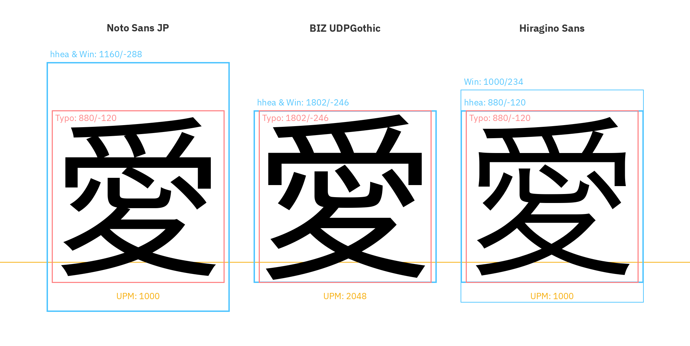
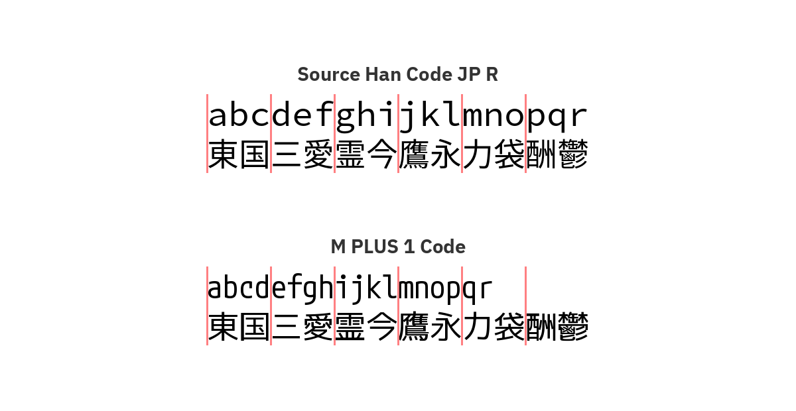
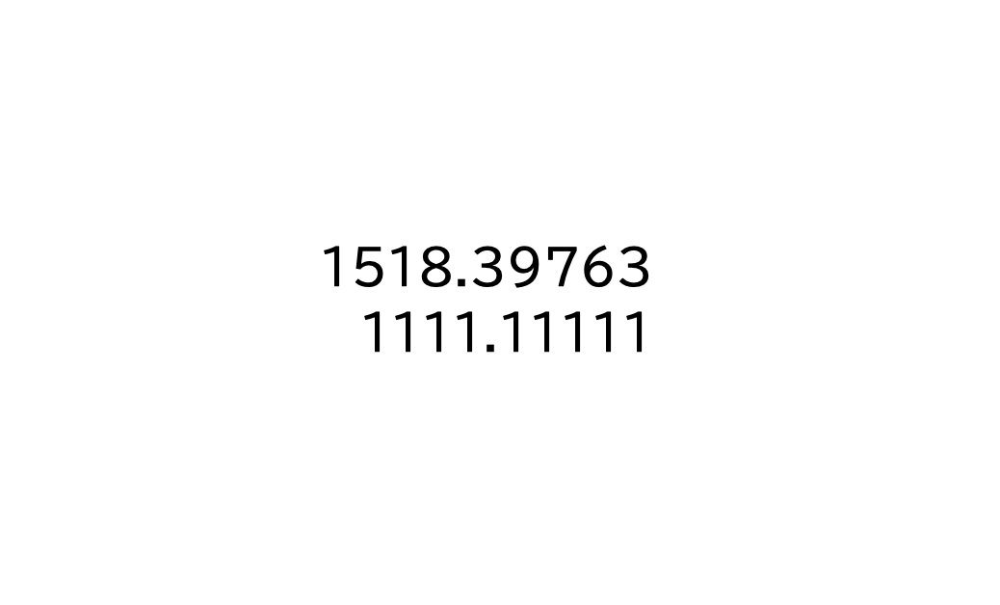
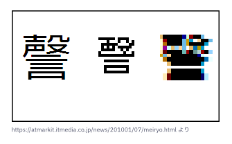
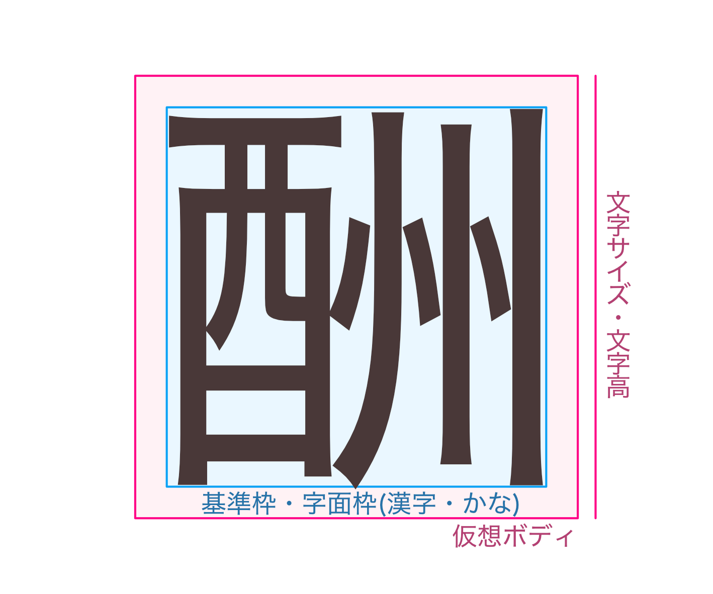
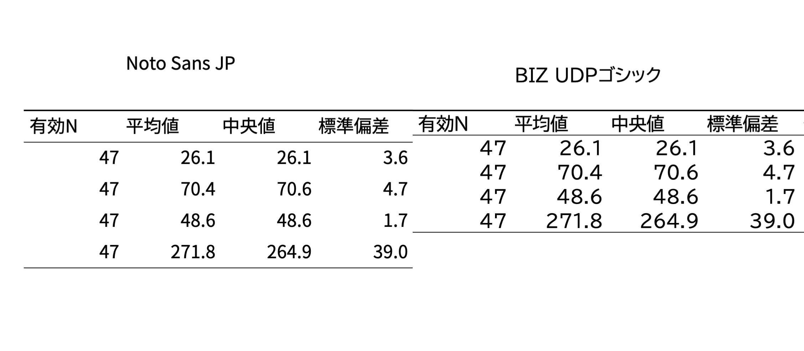
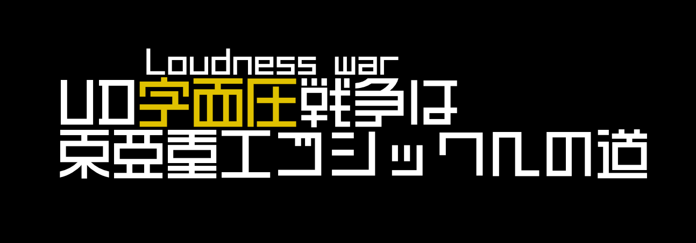

## はじめに
ファイルやドキュメントを共有するとき、共有先には同じフォントがないために、意図したデザインで表示されていない可能性があります。意図通りに表示したいとき、考慮すべきことを調べました。
### TL;DR
- 「Noto Sans JP」は本文におすすめ！
- 「BIZ UDPゴシック(Gothic)」はタイトル・見出し・看板サインなどにおすすめ！
- フォントベンダーはフォント名を変えたらリリースノートを作成してください
- UDフォントは読みやすいと言われますが、いいえ、字面が大きく隣り合う文字との間に適度な空間が保たれないと文字どうしが干渉しあい、かえって読みにくいことがあります
### 新規性
WindowsとmacOSそれぞれの環境で利用可能なフォントの解説や、そのうちオススメのフォントについて説明した記事は多く見つけることができます。フォント特有の概念や用語についてもカバーされています。代表的なものとして：
- [とほほのフォント入門 - とほほのWWW入門](https://www.tohoho-web.com/ex/font.html)
- [フォントの選び方（伝わるデザイン）](https://tsutawarudesign.com/yomiyasuku2.html)
- [2025年に最適なfont-familyの書き方 - ICS MEDIA](https://ics.media/entry/200317/)

しかしフォント名が変更されうることと、フォント名が変更された結果としてメディアファイルやドキュメントの表示が崩れることについて着目した記事は見当たりませんでした。リリースノートを作成する提案も比較的新しいでしょう。
また縦方向の平均字面率（JIS 第一水準:2024-09-18）を算出したことは、有効性はともかく、新規性があります。
### 背景
筆者はmacOSを使ってドキュメントを作成することが多く、そのドキュメントをWindows利用者に渡すことがあります。はじめに述べたようにOSをまたぐとフォントが呼び出せず表示が崩れることがあります。フォントを埋め込めるPDFで渡すようにしていましたが、WordやExcelなどフォントを埋め込めないファイル形式で渡す必要がある場面もままあり[^embedfont]、どのようなフォントを選択するべきか日頃から悩んでいました。

さらにフォントがフォールバックされた文書は、Windowsで自分で開いてみると文字形が違うだけではなく「ptは変わらないのに何となく文字が小さかったり大きかったりする」のです。

このような体験からOSを跨いで安定して扱うことのできるフォントについて調べ始めました。

[^embedfont]: なおWindows版のMSOfficeではフォントを埋め込める

### 今回扱うフォント
* UDデジタル教科書体
* BIZ UDPゴシック
* Noto Sans JP
* IBM Plex Sans JP
* M PLUS
* さわらびゴシック
* 遊ゴシック
* LINE Seed
* メイリオ
#### 扱わないフォント
* 読みにくい、もしくは印刷や高解像度環境に適していない
	* `ＭＳ ゴシック`
	* メイリオUI
	* IPAexフォント
* フリーではない
	* イワタUDゴシック
	* 新ゴUD
	* TBUDゴシック
	* 小塚ゴシック
### 今回のフォント選定の基準
- **名前:** 複数のOS環境でも同じ名前で呼び出せる
- **読みやすさ:** 読みやすい
- **ライセンス:** OSやソフトウェア側で解決されている。もしくはSILなど可用性の高いライセンスで配布されている。
- **費用:** 追加の支払いが発生しない
- **OS:** OSやソフトウェアにデフォルトで入っていること。特にWindows環境には標準搭載されており、フォント導入の負担がないこと
- **言語:** 和文に対応している、欧文も含まれている
- **字形:** 数字が等幅（とうはば）であること。経理やデータ分析の際に桁数が揃うことで誤読の可能性を低減できる
- **出力:** 高い画面解像度で作業するときに美しく見える。低解像度下(96dpi)でも読みやすく表示できる。印刷して美しく出力される。
#### 読みやすいことについて
シルエットの似た数字の開口部を広く保つことや、同化せず明瞭な濁点と半濁点、見た目を散らして区別しやすい欧文グリフ、隣り合う文字との間に適度な空間が保たれるなど、各社がUDとつけたフォントは読みやすさが強く意識されている。なおデザイン書体を除いて、いずれのフォントはUDと名打たれていなくとも読みやすさは考慮されている。

ところで大活字本からもわかるように、読みやすさとは文字形だけではなく文字サイズも大きな要因である。どのようなフォントを選ぼうとも文字のサイズを大きくすることは読みやすさにとって重要である。また「かんたんな日本語」や校正における「ひらく・とじる」にあるように、名詞と漢字の密度や、一文の内容や論理の展開量によっても理解のしやすさは変わる。

読みやすさが多くの要素の集合であるとすれば、今回候補にしたフォントは、どれも十分読みやすいと言えるだろう。タイポス[^typos]が使われた「窓ぎわのトットちゃん」（黒柳徹子 1981）のように、ゴシック体でも読みやすい本文組みをすることができる。
[^typos]: [亮月製作所＊書体のはなし・タイポス](http://ryougetsu.net/sho_typos.html)
#### UDについて
今回は書体がUDを主張している[^udfont]ことを要件としない。なぜなら、UDフォントは読みやすいと言われるが、字面が大きく隣り合う文字との間に適度な空間が保たれないと文字どうしが干渉しあい、かえって読みにくいことがあるためである[^dekaud]。UDフォントは「見やすさ」のために字面の大きさを特徴とするものが多くある。

また、おそらく「ふところの広さ」は「読みやすさ」に貢献しないと私は考えている。しかし少なくないUDフォントがふところの広さを「読みやすさ」の要素として主張している。どちらが正しいのか根拠になる資料は見つからず、現時点ではまだ「読みやすさ」について十分な定説がない状況と判断した。またイワタによれば、UDフォントにおいて、視認性と可読性は相反するとされる[^iwataud]。このようなわけで今回はUD主張を要件としない。

しかしこれはUDの思想や精神、取り組みを否定するものではない。どの書体を採用するか官能的な判断が難しい場合は（たとえ本文組みであっても）UDフォントを使うことが適切だろう。このUD書体を積極的に選ぶ姿勢が浸透することにより、例えばHG創英角ポップ体や`ＭＳ ゴシック`またデザイン書体やコンデンス書体を短文組みや本文組みに使いあまつさえ印刷される悲惨な状況が回避される。

またUD書体については「読みやすさ」や「見やすさ」に効果があるという研究結果もあれば見出せないという研究結果もある[^udresno] 。書体開発のための社内資料として良い取り組みである、フォントベンダーが主体や依頼者となって研究を行うケースでは、1つは利益相反があること、もう1つは比較対象の書体が開示されないこと、以上2つの状況から研究の強度が低くなっていることに注意が必要だ。いずれメタ分析が行われるだろう。

そしてどのようなフォントであれ、読めることは書体デザイン時に意識されている。とくに本文書体であれば読みやすさは重要な項目であり高度に達成されていることが多いはずだ。書体デザイナーの専門性と技術やこだわりは相当なものである。UDとついていない書体でも十分に読みやすい文字になっていることは認識される必要がある。

改めて、UDの思想や精神、目標や取り組みはすばらしいもので、わたしたちは様々な場面で試行錯誤しながら読みやすい文字や文章を社会に実装していくべきだ。この記事もUDの目標に関連し貢献するものである。

[^udfont]: [UD書体 | モリサワのフォント | 株式会社モリサワ](https://www.morisawa.co.jp/fonts/udfont/), [UDゴシック - 株式会社イワタ](https://www.iwatafont.co.jp/font/udgo/)
[^dekaud]: [8　 書体の歴史の穴を埋めたい。 | 書体をつくるひと。書体デザイナー・鳥海修さんの仕事 | 鳥海修 | ほぼ日](https://www.1101.com/n/s/torinoumi/2024-05-23.html)。2025年7月にブログプラットフォームnoteのフォントが一時的にBIZ UDPゴシックになった、この時の利用者の反応は、以前のフォントへの慣れや親和感もあるだろうが、興味深い：[Noteのフォントが変わって、戻った｜꒰⍤꒱ ⁴ᵇ](https://note.com/4bitid/n/nd9a502be5bf8)。
[^iwataud]: イワタのUDフォントの開発の経緯とその展開については：（水野 2019）[UDフォント -ディジタル時代と社会が生んだタイプフェース-｜情報学広場：情報処理学会電子図書館](https://ipsj.ixsq.nii.ac.jp/records/199695)。字個々の見やすさが視認性，長文での読みやすさが可読性として明確に区別され、優先順位は①視認性＞②判読性＞③デザイン性＞④可読性であること、ターゲットは横組みかつ単語を中心とした短文であること、(UD)フォントを作るにあたり何より難しいのは視認性と相反する可読性とデザイン性をいかにバランス良く取り入れるかであることなどが書かれている。更に新たな市場の開拓という商業的な背景があることも述べられている。なぜ他フォントベンダー含む後続のUDフォントが視認性と可読性を曖昧にしてPRを行っているかは不明。
[^udresno]: [ユニバーサルデザインデジタル教科書体が発達性読み書き障害児群の音読の正確性，流暢性および読解力に与える影響 | CiNii Research](https://cir.nii.ac.jp/crid/1390577431250834688)、[古川千咲, 牛山道雄. フォントの違いと視認特性が可読性に及ぼす影響に関する研究. 総合教育臨床センター研究紀要](https://www.kyokyo-u.ac.jp/Ccce/5a4d50f574a804f856144d4688595c932fece49d.pdf)、[2F3-3　UDフォントによる組版の設定が文章の可読性に与える影響について（第2報）](https://www.jstage.jst.go.jp/article/jje/51/Supplement/51_S322/_article/-char/ja)
#### OSについて
今回は WindowsとmacOSのみを対象にする。スライドや表計算ソフトはPCで扱うことが大半であるためである。iOS、iPadOS、Androidは対象としない。ちなみに iOS と iPadOS は macOS 環境とほぼ同じだが、游書体がないなどの違いもある。残念なことに、Androidには明朝体がデフォルトで入っていない。また＊nixも対象としない。
#### 言語について
日本語には星の数ほど文字がある。常用漢字は約2,000文字、そのうち日常でよく使う文字は1,500文字程度である。フォントを選ぶ際には、まれに使う文字も含めて十分な文字がセットになったフォントを選ぶ必要がある。また書体には、欧文のみが含まれるものと、和文フォントと欧文グリフが含まれたものがある。日本語を書くために、十分な数の日本語のグリフが含まれたフォントを探す。
#### 出力について
実はパソコンの解像度（OS解像度 [^osdensity]）は40年ほど変わっていない。大きくなったのはディスプレイの縦横のピクセル数（総画素数・一般に画面解像度 [^pixelsum]）と一定の物理的面積の中に配置される液晶素子ユニット等の密度（一般に画素密度 [^pixeldensity]）であり、あるptのフォントが何pxで描画されるかは、ずっと一緒なのである。

総画素数が、SVGA(800x600)・XGA(1024x768)・SXGA(1280x1024)・HD(1366x768)・FHD(1920x1080)・4K(3840x2160)と大きくなったのにも関わらずである。なおディスプレイの物理的な縦横サイズは製品によって違うため、画素密度は時期に関わらずまちまちである。

具体的には、Windowsでディスプレイを未だに等倍で使っている場合、OS解像度は40年前と変わらず96dpi(ppi) [^dpippi] であり、10.5ptの文字は40年前と同じ8〜13px程度で描画される[^macosdpi]。

ちなみに2010年に登場したRetinaディスプレイ（規格）でやっと解像度が大きくなった[^retina]。具体的には2倍の192dpiと3倍の288dpiである。言い換えると1文字を描画するのに20px四方や30px四方も使えるようになったのである。とても潤沢なピクセル数で、これまでは潰れていた細い線やセリフやウロコなど、書体の細かいニュアンスが表現できるようになった。平成明朝体も表現できる[^mincho]。`JIS C 6234 ドットプリンタ用24ドット字形`もありのまま描画できるのだ[^jisc6234]。
[^osdensity]: 一般には画素密度やピクセル密度としての画面解像度とも呼ばれるが、一定の物理的面積の中に配置される液晶素子ユニット等の密度と区別するために、ここではOS解像度と呼ぶ。まれに理論解像度や論理解像度とも呼ばれる。ちなみに物理シミュレーションの格子サイズも解像度と呼ばれ、解像度は様々に使われる呼称である。
[^pixelsum]: 縦横のピクセル数・総画素数は、画面サイズとも呼ばれるが、ディスプレイの物理的な縦横サイズと混合しやすい
[^pixeldensity]: 画素密度の他に、ピクセル密度, Pixel density, Screen density, Display densicy とも呼ばれる
[^dpippi]: 印刷分野では、見た目に期待できる精細度としてLPI（Line Per Inch, 線数）、物理的なインクドットのサイズ（シャノンの標本化定理より）DPI（Dot Per Inch）が単位として使われている。印刷との混合を避けるために、ディスプレイ系の解像度をPPI（Pixcel Per Inch）と呼ぶことが主張されることもある。今回は印刷のことを話さないためdpiと表記する。
[^macosdpi]: macOSの場合は72dpiである。
[^retina]: [密度記述子を使用する  |  Articles  |  web.dev](https://web.dev/articles/codelab-density-descriptors?hl=ja)。高OS解像度に対応していないコンテンツの1pxを4pxや9pxに引き伸ばして描画する機能があり、話が更にややこしくなる。
[^jisc6234]: [ドットフォントの雑学（３）─フォント千夜一夜物語（24）](https://www.jagat.or.jp/past_archives/story/6612.html)
[^mincho]: 明朝体は縦に組むためのものという意見もある：[あなたは今、どんな書体で読んでいますか？／鳥海修【前編】　神楽坂ブック倶楽部イベントレポート | イベントレポート | Book Bang －ブックバン－](https://www.bookbang.jp/article/537553/2)
#### 字形について
サンセリフとゴシック体は、何が違うのだろうか。日本語(欧米)の文字は、明朝体(セリフ体)・ゴシック体(サンセリフ体)・筆書体(スクリプト体)・デザイン書体(デザイン書体)の4種類に大別される[^fontvar]。このうち、ゴシック体とサンセリフ体とは、線の太さが一様でウロコのない書体だ。

40〜50年ほど溯るパソコンの黎明期、1文字を縦横6,7px程度で表現していた解像度の時代には、そもそも大まかに字形を似せるだけで精一杯ましてや明朝体の線の太さの描き分けなどは夢のまた夢で、ゴシック体を描画する以外の選択肢がなかった。次第に液晶ディスプレイのサイズは大きくなったものの、画面解像度は96dpiでずっと変わらず、十分な解像度の鏑矢であるRetinaディスプレイの出現は2010年を待つことになる。現在の高解像度ディスプレイあれば明朝体を十分に表現する力はあるが、少なくとも40年近くゴシック体は標準として使われており、ユーザーの慣れもあるからこれからも使われるだろう。

今回は複数の環境をまたいで安定したフォントという前提のため、どのような環境でも十分描写できる角ゴシック体のフォントに限定した。[^marugo]

[^fontvar]: 文字形の分類は [書体の使い分け（伝わるデザイン）](https://tsutawarudesign.com/yomiyasuku1.html) より。セリフとサンセリフの2項目で説明されることも多く、逆にさらに細かな分類もできるが、今回は4項目を採用する。
[^marugo]: 丸ゴシックはやわらかく目にやさしくて、自分用のドキュメントでは丸ゴシックを使うことが多い。しかし共有する資料を丸ゴシックで書いたら社会性や常識を疑われかねないので、無難に角ゴシックを選択する。印刷せずディスプレイ閲覧のみにもかかわらず慣習で明朝体が指定するケースはよくあるが仕方がない
### それぞれのフォントが何を満たしているかのテーブル

| 書体名              | Windows標準 [^wcf] | macOS標準 | MSOffice標準[^msocf] | フリー [^gff]                                                              | 書体名ゆれ                                                                | P数字          | 文字セット範囲                                   | デザイナー                                  | メーカー                      | ライセンス       | 平均字面率 |
| ---------------- | ---------------- | ------- | ------------------ | ----------------------------------------------------------------------- | -------------------------------------------------------------------- | ------------ | ----------------------------------------- | -------------------------------------- | ------------------------- | ----------- | ----- |
| UDデジタル教科書体       | ○  [^muddw]      | ×       | ○                  | [△](https://www.morisawa.co.jp/products/fonts/bizplus/lineup/) [^muddf] | UD Digi Kyokasho \[N,NK,NP,ProN]\[-RB] [^muddf2]                     | ○ [^muddpn]  | Adobe-Japan1-4                            | 高田裕美, 他                                | タイプバンク, モリサワ              | 配布者毎        | -     |
| BIZ UDPゴシック      | ○ [^mbw]         | ×       | ×                  | [○](https://fonts.google.com/specimen/BIZ+UDPGothic)                    | BIZ UD\[P]Gothic                                                     | △ [^bizgpn]  | Windows-31J+JIS X 0213:2004+独自 [^bizmoji] | 不明                                     | モリサワ                      | SIL OFL 1.1 | 0.936 |
| Noto Sans JP     | ○ [^gnw]         | ×       | ×                  | [○](https://fonts.google.com/noto/specimen/Noto+Sans+JP)                | Noto Sans \[JP(Japanese), CJK JP], 源ノ角ゴシック(Source Han Sans)[^notofn] | ○  [^notopn] | Pan-CJK 65,535文字                          | 西塚涼子, Paul D. Hunt, 他 [^notodesign]    | Adobe, イワタ, Google        | SIL OFL 1.1 | 0.906 |
| IBM Plex Sans JP | ×                | ×       | ×                  | [○](https://fonts.google.com/specimen/IBM+Plex+Sans+JP)                 | -                                                                    | ○            | Adobe-Japan1-7 [^ibmmoji]                 | Mike Abbink, 他, 和文は不明 [^ibmdesign]     | IBM, Bold Monday, Sandoll | SIL OFL 1.1 | 0.901 |
| LINE Seed        | ×                | ×       | ×                  | [○](https://seed.line.me)                                               | LINE Seed JP\[\_A]\[\_OTF,\_TTF]                                     | △            | Adobe-Japan1-3 [^linemoji]                | 藤田重信, 森田隼矢, 他                          | LINE, フォントワークス            | SIL OFL 1.1 | 0.897 |
| M PLUS           | ×                | ×       | ×                  | [○](https://fonts.google.com/specimen/M+PLUS+1)                         | M PLUS \[1,1p,2,1 Code], M+ \[BITMAP FONTS] [^mpfn]                  | ○            | JIS第一水準＋一部の第二水準漢字まで [^mplusmoji]          | 森下浩司                                   | -                         | SIL OFL 1.1 | 0.892 |
| さわらびゴシック         | ×                | ×       | ×                  | [○](https://fonts.google.com/specimen/Sawarabi+Gothic)                  | Sawarabi Gothic                                                      | ○            | JIS第一水準＋第二水準約半数 [^sawarabimoji]           | mshio                                  | -                         | SIL OFL 1.1 | 0.894 |
| 遊ゴシック            | ○                | ○       | ○                  | ×                                                                       | Yu Gothic, 游ゴシック\[体]                                                 | ○            | Adobe-Japan1-6                            | 鳥海修, 他                                 | 字游工房                      | 配布者毎        | -     |
| メイリオ             | ○                | ×       | ○                  | ×                                                                       | Meiryo \[UI]                                                         | ○            | JIS X 0213:2004＋独自 [^mairyomoji]          | 河野英一, Matthew Carter, 坂本達, 鈴木竹治, 植田由紀子 | マイクロソフト, C&G, アーフィック      | 配布者毎        | -     |
[^wcf]: [Font List Windows 11 - Typography｜Microsoft Learn](https://learn.microsoft.com/en-us/typography/fonts/windows_11_font_list)
[^gff]: [Browse Fonts - Google Fonts](https://fonts.google.com)で配布されているフォントは、全てGoogle Sheet, Docs, Slide で利用することができる。なおメイリオは使えるもののPDF化の際にMS Pゴシックに変換される：[パワポ慣れしている人ほど知ってほしい！Google Slidesで失敗しないフォントの選び方 ｜プレゼンデザイン](https://ppt.design4u.jp/how-to-choose-the-best-fonts-for-google-slides-2024/)
[^muddw]: UDデジタル教科書体は`Windows 10 Fall Creators Update` 以降に標準採用：[モリサワ「Windows 10 Fall Creators Update」での「UDデジタル教科書体」正式採用を発表｜ニュース&プレスリリース｜企業情報｜株式会社モリサワ](https://www.morisawa.co.jp/about/news/3681)
[^mbw]: BIZ UDPゴシックは `Windows 10 October 2018 Update` 以降に標準搭載：[モリサワ「Windows 10 October 2018 Update」での「BIZ UDゴシック/明朝」の正式採用を発表｜ニュース&プレスリリース｜企業情報｜株式会社モリサワ](https://www.morisawa.co.jp/about/news/4010) 、なお発表資料ではフォント名が `BIZ UDゴシック Regular　プロポーショナル` と表記されているが  `BIZ UDPゴシック` で呼び出せた（[モリサワ、「BIZ UDフォント」の「Windows 10 October 2018 Update」採用を正式発表 - 窓の杜](https://forest.watch.impress.co.jp/docs/news/1149745.html)）
[^gnw]: Noto Sans JPは2025年5月ごろからWindows10/11に標準搭載：[Windows 10/11に「Noto」フォントが標準搭載へ ～日中韓のWebブラウジングが改善 - 窓の杜](https://forest.watch.impress.co.jp/docs/news/1670239.html)
[^bizgpn]: `BIZ UD"P"ゴシック` の数字はほぼ等幅だが、1のグリフのみ幅が細い。`BIZ UDゴシック` は全ての数字が等幅だが幅が日本語の1/2と狭い：[読みやすい「BIZ UD」を帳票向けにカスタマイズした「帳票 UDPゴシック」フォントが公開 - 窓の杜](https://forest.watch.impress.co.jp/docs/news/2016989.html)
[^bizmoji]: [モリサワ 「Google Fonts」へユニバーサルデザインに配慮した「BIZ UDフォント」を提供｜ニュース&プレスリリース｜企業情報｜株式会社モリサワ](https://www.morisawa.co.jp/about/news/6706)
[^ibmmoji]: [日本語フォント「IBM Plex Sans JP」に1万3千以上のグリフ追加 ～「Adobe-Japan1-7」を完全網羅 - 窓の杜](https://forest.watch.impress.co.jp/docs/news/2025991.html)
[^notopn]: コード向けの欧文書体を合わせたフォント`Source Han Code JP｜源ノ角ゴシック Code` をAdobe公式が配布している：[GitHub - adobe-fonts/source-han-code-jp: Source Han Code JP｜源ノ角ゴシック Code](https://github.com/adobe-fonts/source-han-code-jp)[オフィス・ドキュメント フォント - 窓の杜](https://forest.watch.impress.co.jp/category/offc/font/)
[^msocf]: クラウドフォントの搭載は2019年4月から：[A Guide to Cloud Fonts in Microsoft 365 (Updated October 2025) - DESIGN TO PRESENT](https://designtopresent.com/2024/06/20/a-guide-to-cloud-fonts-in-microsoft-office-365/)、[Cloud fonts in Office - Microsoft Support](https://support.microsoft.com/en-us/office/cloud-fonts-in-office-f7b009fe-037f-45ed-a556-b5fe6ede6adb)
[^muddf]: UDデジタル教科書体は以下の2つのサブスクから安価に利用できる：[MORISAWA BIZ+](https://www.morisawa.co.jp/products/fonts/bizplus/lineup/)（月額330円,文字範囲はProではない, N・NK・NP）と[Morisawa Fonts フリープラン](https://morisawafonts.com/plans/free/)（無料, ProNのみ,NPとNKは含まれない）
[^muddf2]: UDデジタル教科書体は、Windows11 バージョン 24H2でフォント名が変更された。つまり2025年6月以前にUDデジ教を指定していた文書は現在フォントを呼び出せずデザインが崩壊している：[\[059196\]Windows 11 バージョン 24H2環境における「UD デジタル 教科書体」の利用について　（J-License商品）](https://support.justsystems.com/faq/1032/app/servlet/qadoc?QID=059196)[「MORISAWA BIZ+」に最新のWindows環境へ準拠した「UD デジタル 教科書体 N/NK/NP」3書体を追加｜株式会社モリサワのプレスリリース](https://prtimes.jp/main/html/rd/p/000000572.000010848.html)
[^muddpn]: UDデジタル教科書体はN・NP・NKに関わらず全て数字は等幅
[^notofn]: Noto Sans JPは、AdobeとGoogleの共同開発で配布元により名称が違う、中身は同じ。Google配布版は`Noto Sans JP`（表記ゆれとして`Noto Sans Japanese`）、Adobe配布版は`源ノ角ゴシック`・`Source Han Sans`、Adobe環境でGoogle版を使うとき`Noto Sans CJK JP`：[ウェブ制作者のためのNoto Sans JP最新実装ガイド - ICS MEDIA](https://ics.media/entry/250718/#結局、どうすればいい？)。`Noto Sans CJK JP`は以前はGoogle Fonts でも配布されており、これは中国語・韓国語・日本語がすべて同梱され日本語が優先されるフォント、サイズが非常に大きかった：[【2025年最新】Noto Sans CJK JPをダウンロード＆インストール【フォント】｜ｍion](https://note.com/_m_ion/n/n76abbb8b1ce7)。2014〜2016年のアーリーアクセス時には`Noto Sans Japanese`というフォント名で配布されていた：[Noto Sansダウンロードのはなし - 電脳情報局](https://www.omakase.net/blog/2022/10/noto-sans.html)、[「Noto Sans JP」と「源ノ角ゴシック」なにが違うの？　〜我々はどちらを使えば良いのか問題〜｜加藤朋義](https://note.com/tomoyoshi_kato/n/n53cfd4137e4a)。
[^mpfn]: もともと 1p, 1c, 1m, 1mn, 2p, 2c, 2m の7種類あったようだが、どこかのタイミングで 1, 2, 1 Code, Code Latin に整理されたらしい。リリースノート等がなく情報が不足しており確定できない：[M+ FONTS](https://mplusfonts.github.io)、[美しいフリーフォント M+ FONTS の種類が多すぎてわかりにくいので比較してみた｜手帳.net](https://techoh.net/mplus-font-types/)、[ipsj.or.jp/magazine/9faeag000000zezt-att/IPSJ-MGN601108.pdf](https://www.ipsj.or.jp/magazine/9faeag000000zezt-att/IPSJ-MGN601108.pdf)
[^notodesign]: [【知ってた？】Noto SansとNoto Sans Japaneseの欧文ってまったく別物なのよ｜中田デザイン事務所です。](https://note.com/nakata_design/n/n50ca2310648e)
[^ibmdesign]: [06 Specs｜IBM Plex](https://www.ibm.com/plex/specs/)、[Sandoll Completes IBM Plex Sans CJK Development, Emerging as a Typography Partner for Global Brands](https://www.businesswire.com/news/home/20250304195151/en/Sandoll-Completes-IBM-Plex-Sans-CJK-Development-Emerging-as-a-Typography-Partner-for-Global-Brands)
[^linemoji]: [丁寧な手書き感のあるPOP体風のマンガ向けフリーフォント「源暎ぽっぷる」v1.0が公開 - 窓の杜](https://forest.watch.impress.co.jp/docs/news/1474861.html)
[^mplusmoji]: [【フリーフォント紹介】M PLUS 1（ダウンロード方法も解説）](https://free-fonts.jp/mplus1/)
[^sawarabimoji]: [【レビュー】漢字も含めてオリジナルで制作されている「さわらびフォント」 - 窓の杜](https://forest.watch.impress.co.jp/docs/review/695350.html)
[^mairyomoji]: [メイリオ | フォント用語集 | 文字の手帖 | 株式会社モリサワ](https://www.morisawa.co.jp/culture/dictionary/1945)
## フォントと名前
### 1つのフォントには5つの表し方がある
以下それぞれの名称は、macOSでは標準Font Bookアプリで確認できる。
#### ファミリー名
例：`ヒラギノ`, `ヒラギノフォント`, `ヒラギノ角ゴシック`, `游書体`, `游明朝体ファミリー`
書体名のオプション指定による表記ゆれをまとめる場合や、フォントベンダーの製品アピールのために複数の書体をまとめる必要がある場合などに、ファミリー名という名前で書体群が表現されることがある。一般ユーザーが勝手に呼んでいて広く定着した呼称もここに含まれるだろう。なおフォント名称の核となる単位は、次項の書体名である。

従来は、文字の骨格やエレメントが同じで線の太さだけを変えたものがファミリーと呼ばれていた[^fontfamily]。書体が増えるに従い、例えばモリサワはウェイト以外のバリエーションを内包できる「グラデーションファミリー」という書体群の呼び方を作成している[^morifontname]。ウェイト以外のバリエーションとは、例えば骨格は同じだがエレメントに変化をつけるなどである。

またCSSのパラメタ名は `font-family` だが、実態は次項の書体名である。和文圏と欧文圏で概念の範囲が違うのかもしれない。
[^fontfamily]: [字游工房｜JIYUKOBO | 游明朝体ファミリー](http://www.jiyu-kobo.co.jp/library/ymf/)
[^morifontname]: [グラデーションファミリー | フォント用語集 | 文字の手帖 | 株式会社モリサワ](https://www.morisawa.co.jp/culture/dictionary/1911)
#### 書体名（・フォント名）
例：`ヒラギノ角ゴシック体` [^hkgt], `ヒラギノ角ゴシック` [^hkg], `ヒラギノ角ゴ ProN` [^hgkgpn], `Yu Mincho`, `YuMincho`, `游ゴシック`, `游ゴシック体`
わたしたちがフォントの名前と言われて思い浮かべる表記である。DTPソフトウェアで指定するのはこの表記が多く、CSSのfont-familyで指定する名前もこれがベースになっている。
日本語と英語、もちろん他の言語でも表記ができる。ただし多くのアプリケーション上では、システム言語に合わせてどちらかの言語のみでしか候補表示や指定ができないことが多い。

原則として、ウェイトと斜体は書体名には含まれず（同一書体のバリエーション扱い）、プロポーショナル（以降P指定かP書体と呼ぶ）と等幅の違いは書体名に含まれる（別書体扱い）。もし書体名のみをアプリケーションで指定した場合、ウェイトはデフォルトでW3あたりが充当されるか、別の入力フィールドでウェイトを指定する必要がある。

しかし稀に原則が崩れる。過去、フォントパッケージは1ファイルがそのままシンプルに1パッケージになっていた時期から、複数ウェイト・斜体・カーニング情報などを同一のフォントとして扱えるようにメタデータの処理が進歩してきた経緯がある。そのため古めのフォントでは書体名にウェイトやP指定が直接記述されることもある（ウェイトやP指定が別書体扱い）[^namep]。字形の違い「表示用」と「本文用」や「朝霜かな」と「文麗かな」などは、1書体のバリエーションであることもあれば、書体名で切り替えて指定することもある。

混乱を招くことに、全く同じ書体でも、例に挙げたように末尾に「体」がつくものや、集字範囲「Pro」などがつくものなど微妙な表記揺れがある。
混沌としているように見えるが、フォントベンダーの特徴を考慮して個別のフォントにおいて判断するしかない。[^fontnaming]

[^namep]: `UD デジタル 教科書体 NP-B` は、プロポーショナルとボールドの指定が書体名に含まれている。`イワタ細明朝体`と`イワタ極太明朝体オールド`は、ウェイトの指定が書体名に含まれている。`イワタUDゴシック Ｍ 表示用／本文用`は、タイトル用と本文用の字形が書体名に含まれている：[フォント情報一覧 - 株式会社イワタ](https://www.iwatafont.co.jp/font-list/)
[^fontnaming]: フォントベンダーの内部でも場面によって呼び方を使い分けている：[『みんなの文字対談 ～応用編～』を公開しました。 - 株式会社イワタ](https://www.iwatafont.co.jp/news/『みんなの文字対談-～応用編～』を公開しました/)。またフォントベンダーはフォントメーカーと呼ばれることもある、おそらくベンダーは国内的な呼び方で、メーカーが英語圏の呼び方か：[現在使用しているフォントがフォントメーカーによって更新された場合はどうなりますか？](https://helpx.adobe.com/jp/fonts/using/update-font-version.html)
#### フォントメニュー名・フォント名withウェイト
例：`ヒラギノ角ゴ Pr6N W3`, `Hiragino Kaku Gothic ProN W3`
ファミリー名・書体名に、ウェイトやスタイルを追加した表記。ファミリー名と同様に、日本語と英語で表記ができる。プログラム中でフォントを指定するときに使われることがある。モリサワによれば「メニュー名欄の表示はアプリケーションによって異なる場合があります」とされる。PostScript名を単にひらいたものか、それとも規格に定められた表記なのかは不明。
#### PostScript名（PS名）
例：`HiraginoSansPr6N-W3`
スペースや特殊文字を含まない、一意な名前。かなり一意にフォントを特定できるが、ソフトウェア側が対応していないことが多い。もちろんソフトウェア内部では扱われている。
#### ファイル名
例：`ヒラギノ角ゴ Pr6N W3.otf`
実際のフォントファイルの名前で、人間が扱うことはあまりない。
### バージョン
例：`Ver.004.01`, `1.002`
文字の追加、異体字セレクタ（SVS）の追加、字形の修正、メタデータの更新など、フォントには更新が行われるタイミングがある。[^fversion] ソフトウェアアプリケーションとは違い、統一されたアップデート手順がないこと、パッケージ自体がアップデートの要請もオーガナイズも行わないこと、シンプルさが特徴のフォントパッケージは動かなくなることが稀であることから、ソフトウェアと比較するとパッケージファイルの更新は極めて低頻度である。バージョンの書式は、フォントベンダーによって違う。
[^fversion]: [フォントにもバージョンがあるんです... - DTP Transit](https://www.dtp-transit.jp/font/post_1727.html)
### CSS font-family 名
例：`Hiragino Kaku Gothic ProN`, `Hiragino Sans`
フォント指定の魔境である。ほぼ書体名と一緒だが、フォントメニュー名でも指定可能。もっとも重大な事実として、同じ文字列を指定しても、時期によってOSやブラウザの解釈が異なる。名前通りのフォント名の挙動をしない可能性があると認識する必要がある。またCSSで指定したウェイトと書体ウェイトの紐付けも、OSやブラウザによって異なる表示結果につながる時期がある[^cssweight]。英語での指定がスタンダードだが、実は日本語で指定もできる。ブラウザ間の極端な差異は2017年ごろに解消したと言われる[^iebrowser]。
[^cssweight]: [CSSでヒラギノ角ゴシックのウェイトを指定する方法 - Ryusei’s Notes (a.k.a. M59のブログ)](https://mandel59.hateblo.jp/entry/2015/10/03/205229)
[^iebrowser]: [Webフォント -日本語環境における「戦い」と，文字の歴史の延長線にある基盤技術-｜情報学広場：情報処理学会電子図書館](https://ipsj.ixsq.nii.ac.jp/records/199696)
### ベンダー違いで同じフォントが違う名前に
歴史的な（著作権の切れた）フォンとが復刻された場合、また共同開発したフォントをそれぞれの企業が別々に配布する場合など、同じフォントでも名前が異なる場合がある。なお名前だけではなく細部が異なるケースも多い。
- Noto Sans
	- **Google**: Noto Sans
	- **Adobe**: 源ノ角ゴシック, Source Han Sans
	- AdobeとGoogleの共同企画として作成されたフォント。それぞれの会社からリリースされる際に、GoogleからはNoto Sans プロジェクトの一部として、Adobeからは新しい源ノ角シリーズとして名付けられた。
- Bodoni [^bodoni]
	- American Type Founders: **ATF Bodoni**
	- Bauer Type Foundry: **Bauer Bodoni**
	- International Typeface Corporation: **ITC Bodoni**
	- URW Type Foundry: **URW Bodoni**
	- Monotype: **Monotype Bodoni**
	- Berthold: **Berthold Bodoni**
	- World Typeface Center: **WTC Bodoni**
	- Google: **Bodoni Moda**
	- 18世紀後半にイタリアで作成されたセリフ書体。著作権は数百年前に切れているため復刻書体の作成が可能である。広告デザインなどに人気が高く、多くの復刻が新たに作成され、見分けるために少しずつ違う名前になっている。
[^hkgt]: モリサワの資料より
[^hkg]: よく見る名前
[^hgkgpn]: macOS 10.13 High Sierra 以降、Hiragino Kaku Gothic ProN はHiragino Sans 内に同梱
[^bodoni]: [《書体のはなし》 #21 18世紀生まれの優雅な書体“Bodoni”｜しじみ ｜デザインを語るひと](https://note.com/shijimiota/n/n65529dbda193)

### OS違いで同じフォントが違う名前に
- 例：遊書体
	- Windows: 游ゴシック, `Yu Mincho`
	- macOS: 游ゴシック体, `YuMincho`

游書体は Windows 8 と OS X Mavericks で搭載されたフォントだが、Windowsでは「游ゴシック」、macOSでは「游ゴシック体」と名前が異なる[^yufont]。

このように、同一のフォントがOSごとに別の名称である場合がある。どのような背景かは分からない。複数指定してフォールバックを効かせられるCSSなどの場面では両方指定すれば解決する。しかしWordやExcelなど単一書体の指定しかできない場面ではどうしようもない。

[^yufont]: 游書体は、OSをまたいで同じフォントを扱えるようになると期待されていた。しかし、Windowsのレンダラでは薄く掠れて表示される、iOSには搭載されていないなど、名称以外にも相互運用を妨げる問題があった。
### 安定しているフォントは？
今回のフォント選定の基準からOSを跨いで安定しているフォントを選ぶ。
- **BIZ UDPゴシック**
	- バリエーションが少ない、Pと無印のみで分かりやすい
	- Windowsに標準搭載されている
	- 他の環境でもフリーで導入できる
	- 数字が1を除いてほぼ等幅
- **Noto Sans JP**
	- Windowsへの標準搭載、他のOS環境でもフリー、数字が等幅
	- 名前がややこしい。今でも Noto Sans JP と Noto Sans Japanese が同じものを指しておりコミュニケーションが取りづらい。
	- 2021年春〜夏あたりで主要な名称が `Noto Sans CJK JP` から `Noto Sans JP` に変わった。当初は混乱があったようだが、流石に4年以上経って市井の隅々まで改名が浸透したと期待したい。ちなみにリリースノートもプレスリリースも無かった。
	- 私はこの記事を書くまで Noto Sans CJK JP しかパソコンに入っておらず、時代遅れのドキュメントを撒き散らしていたことになる 🙄
#### 惜しくも安定していないフォント
- **UDデジタル教科書体**
	- Windowsへの標準搭載、数字が等幅
	- macOSでは無料で使える書体が`UDデジタル教科書体 ProN`のため、Windows環境のProなしの`UDデジタル教科書体 N`は呼び出せない。月330円を払えばmacOSでもProなし`UDデジタル教科書体 N`が使えるため互換の問題が解決する[^bizpron]。
	- 2025年6月にステルスでフォント名が変わった。1,2年経って名前が浸透するまでは安心して使いにくい。リリースノートもプレスリリースもない。
[^bizpron]: [フォントラインナップ | MORISAWA BIZ+ | フォント製品 | 製品／ソリューション | 株式会社モリサワ](https://www.morisawa.co.jp/products/fonts/bizplus/lineup/)
## フォントと文字形
### 等幅とプロポーショナル
文字幅指定には2種類がある。等幅は全てのグリフの幅が同じ、プロポーショナルとはグリフによって幅が違う。多くのフォントは両方の幅指定を配布している。一般的に等幅フォントは最大の文字幅に合わせて作られるため、プロポーショナルフォントになると文全体の幅は短くなる。

等幅と名前が付くフォントの場合、欧文グリフは和文グリフの1/2の字幅であることが多い。しかし和文1/2幅の欧文はかなり細く感じられる。書体のバリエーションとして等幅フォントはよく見かけるものの、残念ながら1/2幅は実用的ではなく、等幅フォントは使いにくいフォントと言えるだろう。

「コード・Code」と名前がつくフォントは欧文グリフを和文1/2幅よりも広くとるものがある。例として、欧文グリフが日本語の2/3の等幅である`Noto Sans`や、3/5の等幅である`M PLUS Code Latin 60`がある。ただし文末が揃いにくくなるデメリットもある。

和文に関しては、等幅の方が扱いやすい場面と（ただし間延びする）、文字詰めがある方が読みやすい場面があり（ただし文末が揃わない）、一長一短どちらかが秀でていることもないため、場面場面で選択をする必要がある。多くの和文フォントは等幅とP書体の2種類を提供している。

またOpenTypeフォント（OTF）にはグリフの位置を動かして調整するGPOS（Glyph POSitioning）という機能があり、そのサブセットとしてプロポーショナルメトリクス（palt）という機能がある。GPOSテーブルにグリフの位置を調整するデータをあらかじめ格納しておくことで、等幅フォントとして配布されていてもInDesignやHTML（`font-feature-settings: “palt”;`をCSSで指定する）において字詰めを実現できる。

ちなみに、文字の塊ごとにグリフが右上から左下に流れるアラビア文字のナスタアリーク体など、文字が水平に並ばない言語では、GPOSがないとまともに表示ができない。[^gpos]

[^gpos]: GPOS：[GPOSのCursive Attachment Positioningについて - にせねこメモ](https://nixeneko.hatenablog.com/entry/2017/01/14/200258)、[フォントの組版機能02「GPOSとGSUB」 - Type Project Staff Blog](https://staffblog.typeproject.com/2389)[GPOS テーブル (1)](https://azelpg.gitlab.io/azsky2/note/prog/opentype/23_gpos1.html)[文字詰めできるCSSのfont-feature-settingsが凄い！ 日本語フォントこそ指定したい自動カーニング - ICS MEDIA](https://ics.media/entry/14087/)

### 数字が等幅
数字が等幅ではなくプロポーションになると、表計算ソフトで表示される数字の桁がずれる。先頭桁の位置がずれることで、視覚的で直感的な数値の判断が難しくなる [^tohabanum]。把握しやすい資料を作るためには、桁数を揃えることができる数字等幅のフォントが望ましい場面がある。

和文と欧文がプロポーショナルであるフォントでも、数字が等幅なフォントも存在する。文字種ごとの幅指定の違いがフォントベンダーにより説明されることはあまりないため、個別に手作業で確認する必要がある。
[^tohabanum]: [失敗しない帳票フォント！見やすさ・効率UPの秘訣【2025年版】 - でらくらうど](https://dera-cloud.com/ultimate-form-font-guide/)
### 間違えやすい文字の字形
シリアルナンバーを読み取るとき、0ゼロとOオーを読み違えて再録したら悲劇的である。
間違えやすい文字にはいくつかのバリエーションがあるが以下の2セットが代表的。
- 0oO（数字のゼロ、小文字のオー、大文字のオー）
- 1Il（数字のイチ、小文字のエル、大文字のアイ）

これらの文字が、並べてみたときに区別でき、単独でみたときにも同定できる字形であることが望ましい。
古英語でも、uがunmwと接するとき読みにくいためu→oに変えて書いていたように、アルファベット文字の識別しづらさというのは、少なくとも1,000年以上昔からある問題でもある。
### レンダラで変わる字形
金属活字は印刷すると、にじみ盛り上がり力強くなると言われる。また輪郭が丸みをおびるとも言われる[^printmaru]。インクと紙繊維と圧力の複雑な相互作用である。インクジェットやオフセット印刷はまた違った印象を持つ。そして写植は滲みや光の回折が発生し文字に影響する[^shasholigh]。自分の手でハンコを押すときを思い出すと、インク量や圧力により印字がにじみ線の太さが変わる。印刷は、そのときどきの条件によって出力される字形が有機的に変化するのだ。

ディスプレイでも似たように、単色からカラーにピクセル数の増加にと、さまざまな変化を経て表現力や特徴が変わってきた。

ClearTypeとはフォントレンダラの一種で、液晶ディスプレイがグレースケール（1色）から三原色カラーに変化したあと、三原色の赤緑青サブピクセルそれぞれを単位として描画を制御することで、文字輪郭をより忠実に表現することを意図したアルゴリズムが特徴である。つまりは3倍細かい。類似の技術はmacOS環境ではサブピクセル・アンチエイリアスと呼ばれている。

技術的にはRチャンネルとBチャンネルをそれぞれ外側逆向き水平に1ピクセルずらしてからいい感じに畳むことで元々の1つ外のRやBのサブピクセルまでを活用する。したがってRとBの色が黒い文字の外に出てくることになり、これがカラーフリンジの正体である。色が滲むと違和感を感じる気もするが、サブピクセルの視野角上のサイズが小さすぎるため錐体細胞では一緒に処理され認識できないのか、色の滲みはあまり気にならず不思議な気がする。

さてここで、同じ信号強度を与えてもRとBが官能的には同じ明るさには見えないことを思いだすと、各チャンネルの輝度はガンマ特性で補正してから描画する必要がある。このガンマ補正が2重3重にかかったことで低解像度環境で游ゴシックが掠れて（崩れて）見えたと言われている。[^yugokasure] しかし当該のブログではチャンネル横シフトをかけていないこと、他のフォントは崩れていないことから、私はClearType側の処理は正常でフォントヒンティング処理の方に不都合があった可能性が高いと考えている。例えば低解像度下でヒンティングなしで1ピクセルにまとめられると後続のClearType処理でさらに薄く細くなりカラーフリンジが目立つなどのメカニズムが想像できる。

96dpiで10.5ptを表示する場合[^winsyssize]、(10.5pt ÷ 72inch) × 96dpi = 14px(dot) となる。実のところ14pxは仮想ボディの高さで実際の文字には余白がある。余白を加味すると、欧文の文字高さは8-10px程度、和文の文字高さは10〜13px程度になる。これは書体を描画するには狭くハードなピクセル数である。`ＭＳ ゴシック`やメイリオが見やすいと言われ、游書体が見にくいと言われる場面がある理由は、この小さなpx数にある。[^pixel]

（画像は [実はメイリオまだ進化中！ 誕生秘話を河野氏に聞いた － ＠IT](https://atmarkit.itmedia.co.jp/news/201001/07/meiryo.html) より。『「謦」という利用頻度の低い文字（左）を10.5ポイントで表示した例（分かりやすさのために拡大してある）。中央がMS明朝で、うまく線を間引いてデザインされていることが分かる。右はメイリオによる表示で、ヒンティング情報がないため、文字が潰れてしまっている』）

`ＭＳ ゴシック`は、およそ7.5(5.25)〜15ptの間はあらかじめ手動でドット打ちされたビットマップフォントが表示される[^ricohms]。そりゃ意図した小さなptサイズでは相対的に読みやすいわけである。`ＭＳ ゴシック`はTTF(TrueType Font)であるから、16pt以上ではアウトラインフォントとして表示される。しかしリョービイマジクスの`ゴシック-B`を字母にしたものの、256平方の格子点しか使えない狭く厳しいメッシュ空間で制作したため[^gotb]、エレメントの豊かな細かいニュアンスは消滅し、高解像度環境や大きなptでは字形そのものがガタガタになり、まったく印刷に向かない。美しい書体ではない。

次に、あらかじめ手動でドット打ちせず、美しい字形を自動で縮小していい感じに表示されることを目指したフォントがメイリオである。汎用フォントレンダラのClearTypeが生まれたことが背景にある。これも最適化ゆえに意図した小さなptサイズでは読みやすく、更に、もうちょっとだけ大きなptでも読みやすく表示され、印刷にも耐える。ただしあくまで当時のClearTypeアルゴリズムに最適化されているため、字形には相応の制約がかかっており、書体単体をみて美しいとまでは言えない。

逆に、印字印刷で美しくなることを重視する游書体は、フォントレンダリングのアルゴリズムには最適化していないはずである。小さなptでうまく表示されるかは博打だったが、蓋を開けてみれば残念な結果に終わった。もしかすると96dpiの小さなptでの表示を捨てていたのかもしれないとも思う。具体的には、Windows側ヒンティングの拙い処理により一部のグリフが縦方向に縮むことがあった[^fonthint]。 ぶっちゃけるとClearTypeなどのアルゴリズム側が努力して、どのような書体でも美しく描画できるようにしておくべきだった問題である。このような事例がよくあることからWindowsはフォントが汚いOSと言われることもある。

さて、メイリオとClearTypeの性格から一般化すると、他には、垂直水平線を重用するフォントや字面が大きいフォントも、小さなptで読みやすく出力されやすい可能性は想像できる。したがってUDフォントが96dpiかつ小ptに向いていて潰れず擦れず描画されることは十分ありえるわけだ[^goodud]。

いずれにしろ、同じフォントが指定できたとしても、OSのレンダラの違いやディスプレイが低解像度であるなどを原因として、期待した字形で出力されないことがあることを覚えておきたい。

[^winsyssize]: なおWindowsのシステムフォントは10ptと12ptである。
[^pixel]: Windows96dpiかつ小さなpt数でのスクリーンショット：[游明朝、游ゴシックって見づらく使いづらくないですか？慣れない... - Yahoo!知恵袋](https://detail.chiebukuro.yahoo.co.jp/qa/question_detail/q10226905550)
[^shasholigh]: [亮月製作所＊書体のはなし・石井太ゴシック体](http://ryougetsu.net/sho_bg.html)、[第14回 鈴木一誌デザイン 様｜会員様インタビュー｜フォントストーリー｜年間定額制フォントサービス「LETS」 l Monotype](https://lets-site.jp/fontstory/voice/archives/14)
[^printmaru]: [亮月製作所＊書体のはなし・游ゴシック体](http://ryougetsu.net/sho_yuugothic.html)
[^ricohms]: [ＭＳ ゴシック、ＭＳ 明朝相当のフォントについて知る | リコーPFUコンピューティング株式会社](https://rpc.ricoh.com/products/font/ms)
[^gotb]: [亮月製作所＊書体のはなし・MSゴシック](http://ryougetsu.net/sho_msgothic.html)
[^yugokasure]: [游ゴシックは何故Windowsでかすれて見えるのか - Ryusei’s Notes (a.k.a. M59のブログ)](https://mandel59.hateblo.jp/entry/2016/11/11/012654)
[^fonthint]: [ASCII.jp：“愛されるWindows”を目指して、日本語フォントを改善した最新アップデート](https://ascii.jp/elem/000/001/053/1053846/)。ヒンティングについては以下も参考：[アウトラインフォントの雑学（4）─フォント千夜一夜物語（32）](https://www.jagat.or.jp/past_archives/story/7042.html)
[learn.microsoft.com/en-us/typography/cleartype/pdfs/japannowreadthis.pdf](https://learn.microsoft.com/en-us/typography/cleartype/pdfs/japannowreadthis.pdf)
[^goodud]: UDフォント(特にBIZ UDPゴシック)は字面が大きく長文に向かない、私は苦手な書体だが、では`ＭＳ ゴシック`の印刷物が視界に溢れる状況と、どちらか良いかを選べと言われたら、UDフォントの方がよほどマシである。印刷印字や大pt表示の品質を向上するために`ＭＳ ゴシック`やメイリオを置き換えて一般ユーザーに普及することをしたたかに志向していると考えれば、ぎちぎちのBIZ UDPゴシックにも健気さが感じられる。メイリオで十分と言えばそう。また、Noto Sans JPはころころとした字面の小さく可愛いフォントであるから低解像度なWindowsには最適ではなく一般ユーザーには選ばれづらいだろう。フォントデザイナーはmacOSを使っていたのかもしれない。
## フォントとサイズ
フォントサイズとは、一番大きな文字の上下高さだろうか、それとも全文字の平均の高さだろうか。実はどちらも間違いで、いずれのグリフを内包する任意の四角形の高さこそがフォントサイズである。このグリフを内包する四角形のことを仮想ボディ（os2.sTypo＊\[UPM]やUPM\[UPM]）と言い、中身のグリフの感覚的な大きさのことを字面と呼ぶ[^kasobody]。仮想ボディは、金属活字の時期に四角い活字の中に文字が配置されていた名残でもある。その頃は仮想ではなく実体のある金属のボディであった。

以下の図から分かるように、ほぼ全てのグリフには上下に余白がある。そして余白の平均的な比率は書体によって異なる。フォントサイズを基準に行の高さを設定する場合は、余白が書体ごとに任意に設定されている事実を考慮する必要がある。

仮想ボディや行送り枠と字面の数値は、日常あまり関わりがないと思いきや割と顕在化する。例えば、フォントサイズに合わせて行の高さが自動設定されるExcelである。以下に示す図は、フォントサイズを11ptで固定、行の高さを自動設定し、表示倍率を変えずに、フォントだけを変え、画面を同じサイズ（1000×400px）でスクリーンショットを撮ったものである。BIZ UDPゴシックは字面が大きく仮想ボディにぎちぎちに詰めているために、充填率が高く見える。Noto Sans JPは字面が小さく仮想ボディの上下の余白がかなり多めにあるため、充填率が低く見え。なお行高さの合計の違いは行間（os2.usWin\[UPM]など）[^gyokan] の違いによるもので仮想ボディの違いによるものではない。[^lineheight]

一見して分かるように、同じpt数を指定してもフォントによって、実体的な文字サイズ（字面の大きさ）の違いは知覚できるもので、横方向の「ぎちぎち」や「小さい」のような感覚的な印象も多くの人に共通して感じられるだろう。
この字面の大きさはWebでのレンダリングにおいてもExcelと同様に感じることができる。

今回は字面の大きさを比べるために「平均字面率（JIS 第一水準:2024-09-18）」を新しく設定した。平均字面率（JIS 第一水準:2024-09-18）とは、JIS X 0208を含む文字セットについてのwhatwgによる表現[index-jis0208.txt](https://encoding.spec.whatwg.org/index-jis0208.txt)において定義されるJIS 第一水準の漢字にあたる2,965字とひらがな82文字を対象に、仮想ボディ（os2.sTypo）に対してグリフの上下の頂点間の距離を出し、その平均を出したものである。

結果は「それぞれのフォントが何を満たしているかのテーブル」に記入した。最大のBIZ UDPゴシック（0.939）と最小のM PLUS 1（0.894）で4.45ポイントの差がある。
4.45ポイントは、10.5ptで約0.6px、12ptで約0.7px、20ptで約1.2px、30ptで約1.8pxの差になる。0.6pxはピクセルの線の数の違いとなっては現れないが、アンチエイリアス後の表示の薄さとしては知覚でき、無視できないサイズ差である。

なお仮想ボディを1に揃えて考えるから字面サイズが印象に影響を与えるのである。もちろんフォントサイズの指定が離散的（1もしくは0.5刻み）な伝統があり細かな調整が行われないため仮想ボディを基準とした字面サイズが印象の要素として計上されるのは道理にかなうとはいえ、本当に字形による印象を話すのであれば字面を標準化（ノーマライズ）してから話すべきである。しかし字面のサイズはグリフによって違うため、ラウドネスの算出方法の定義が複雑で難解なように[^roudness]、字面ノーマライズ指標も定義は難しいだろう。

[^lineheight]: [ターミナル上のテキストの行送り幅を調節する - blog.kaorimatz.org](https://blog.kaorimatz.org/2013/12/14/adjust-line-spacing-for-text-on-terminal.html)
[^kasobody]: [仮想ボディ - かそうぼでぃ | 武蔵野美術大学 造形ファイル](https://zokeifile.musabi.ac.jp/仮想ボディ/)、[見やすさと印象が大きく変わる！“字面”を知って最適なフォントを選ぼう｜ヒラギノフォント公式note](https://note.screen-hiragino.jp/n/n86d51b43e27c)、[日本語は「正方形」!　意外と知らない文字設計 | ブログ - Morisawa DTP Lab. | 株式会社モリサワ](https://www.morisawa.co.jp/blogs/MVP/7406)
[^gyokan]: 垂直メトリックつまり行間の扱いは慣習が標準を歪め、WebやDTPデザインにおける中央揃えを極めて困難にしているが今回は触れない：[UIデザインで中央配置がずれてしまう理由と解決方法 | コリス](https://coliss.com/articles/build-websites/operation/work/about-centering.html)、[なぜメイリオは上にズレるのか？ パワポでメイリオをキレイに上下中央配置するコツ ｜プレゼンデザイン](https://ppt.design4u.jp/best-practice-meiryo-centering/)、[バーティカルメトリクス – たぬきフォント](https://tanukifont.com/glyphs-learn/vertical-metrics/)
[^roudness]:  [音圧戦争から遠く離れてーラウドネスノーマライゼーションの誤解と意義 (2/2) - PHILE WEB](https://www.phileweb.com/interview/article/202010/13/765_2.html)、[君は音圧戦争を生き抜けるか？　音楽ストリーミング時代のラウドネス・ウォー対策（1/3 ページ） - ITmedia NEWS](https://www.itmedia.co.jp/news/articles/2007/30/news148.html)
## フォントと文字セット
### 文字の標準と歴史的経緯
どの文字をフォントパッケージに含めるかを定義する力を持った組織には、和文フォントではJISC（JIS X）とAdobe（Adobe-Japan1）がある [^monotype]。大まかには、マシンの処理能力の限界と進歩に合わせて、利用者の使える文字を増やしたい要求をもとに、収録文字数が増えていった。他の代表的な規格策定者としてIPAなどの公共系フォントがある。また、メディアでは共同通信のU-PRESSや、OSメーカーではIBM拡張漢字やWindows-31Jなどもあるが、Adobeに包摂されることが多いため扱わない。

文字コードには文字集合と符号化方式（Shift_JIS, EUC-JP, UTF-8など）の2つの概念 [^tohohofont] があるが、今回は符号化方式には立ち入らない。純粋な文字セットのマイルストーンはUnicodeの普及とそれを可能にしたOTFであるものの、実際のフォントパッケージに使われる文字セットはAdobe規格が未だ標準的である。文字数が多いと作るのが大変だからである。

日常使いであれば、OTF Std のおよそ9,000文字で十分打と言える。実際には1,500文字ぐらいしか普段使いしない。商業印刷、報道メディア、人名戸籍系など場面ごとのニーズに合わせてより収録文字数が多い規格に対応したフォントを選択すれば良い。

[^tohohofont]: [とほほの文字コード入門 - とほほのWWW入門](https://www.tohoho-web.com/ex/charset.html)
[^monotype]: 欧文ではMonotypeのようなフォントメーカーが定義することもある：[サンセリフの基本的な知識と種類を交えてオススメ書体をご紹介 ｜ デザインポケット](https://designpocket.jp/static/font/feature/sans-serif.html)
### 和文フォント文字セット規格の一覧

| 規格名/略称                  | 策定      | 登場時期                   | Adobe-Japan1 [^aj1] | JIS                         | 収録文字数 [^mojisu] | 背景・特徴・用途                                                 |
| ----------------------- | ------- | ---------------------- | ------------------- | --------------------------- | --------------- | -------------------------------------------------------- |
| **JIS X 0208**          | JISC    | 1978, 1969, 1976, 1997 | -                   | JIS C 6226                  | 6,879        | 元は JIS C 6226 と呼ばれていたが途中で改名                              |
| **JIS 第一水準**            | JISC    | 1978, ..., 2004        | -                   | -                           | 2,965           | JIS X 0208の内部で定義。よく使われる文字セット                             |
| **JIS 第二水準**            | JISC    | 1978, ..., 2004        | -                   | -                           | 3,390           | JIS X 0208の内部で定義。使用頻度がやや低い漢字群。人名・地名・専門用語など               |
| **JIS X 0213**          | JISC    | 2000, 2004             | -                   | JIS X 0212, JIS X 0208      | 11,233          | 直接的にはJIS X 0212の後継だが、JIS X 0208の後釜でもある                   |
| **OTF Std**             | Adobe   | 2000年代初期               | Adobe-Japan1-3      | -                           | 9,354           | 必要最小限の標準的な文字セット                                          |
| **OTF Pro\[N]**         | Adobe   | 2000年代中期               | Adobe-Japan1-4      | -                           | 15,444          | 商業印刷用のプロ向けの文字セット。現在のスタンダードとなる。N付きは04字形 [^jis2004] がデフォルト |
| **OTF Pr5**             | Adobe   | 2004年頃                 | Adobe-Japan1-5      | JIS X 0213:2000             | 20,317          | MacOSXと印刷標準漢字にも対応。ほぼ使われなかった                              |
| **OTF Pr6\[N]** [^pr6n] | Adobe   | 2010年                  | Adobe-Japan1-6      | JIS X 0213:2004, JIS X 0212 | 23,058          | U-PRESS（共同通信社）[^upress] に対応。N付きは04字形がデフォルト               |
| **A-J1-7**              | Adobe   | 2020年                  | Adobe-Japan1-7      | -                           | 23,060          | 令和文字など                                                   |
| **IPA** [^ipaft]        | IPA     | 2007                   | -                   | -                           | 約11,233         |                                                          |
| **IPAex**               | IPA     | 2010                   | -                   | -                           | 不明              |                                                          |
| **IPAmj**               | IPA     | 2011, 2024             | -                   | -                           | 58,862          | 公共機関の戸籍系システムに対応                                          |
| **Unicode**             | Unicode | -                      | -                   | -                           | 約110万           |                                                          |

[^mojisu]: [OpenTypeフォントの種類 | フォント用語集 | 文字の手帖 | 株式会社モリサワ](https://www.morisawa.co.jp/culture/dictionary/1984)、[Std、Pro、Pr6、Nってなに？意味を知って賢くフォントを選ぶ！フォント名による違いと使い分け徹底解説｜ヒラギノフォント公式note](https://note.screen-hiragino.jp/n/n677df9b54262)
[^ipaft]: [IPAフォントライセンスを巡って | 一般社団法人 文字情報技術促進協議会](https://moji.or.jp/2024/02/16/ipaフォントライセンスを巡って/)
[^jis2004]: JIS X 0213:2004 で新しくなった168文字の字体は 04字形とも呼ばれる。以前の字形は90字形。OTFフォントであれば1つのパッケージに旧字形も新字形も含まれていて異体字として呼び出せる。つまりはデフォルトで出てくる字形の違いである。なおNなしのパッケージには配布時期によって新字形が含まれていない場合がある。すべての04字形は、常用漢字ではない表外漢字の範囲にあるため、一般ユーザーにはあまり影響しない。
[^pr6n]: 「ピーアールシックス」、「ピーアールシックスエヌ」と読む。「ピーアールロク」とも読まれる。フォントベンダー7社により、Proと合わせて後継規格も3文字にするために、oを0と見立てて、Pr＊と表記されている：[『みんなの文字対談 ～応用編～』を公開しました。 - 株式会社イワタ](https://www.iwatafont.co.jp/news/『みんなの文字対談-～応用編～』を公開しました/)
[^aj1]: 他に、Adobe-Japan1-0（OCF）、Adobe-Japan1-1（KanjiTalk7）、Adobe-Japan1-2（CID）、PostScriptなどもあるが、現在はほぼ使われていないため図表からは省略した：[mathsoc.jp/assets/pdf/overview/committee/info\_system/5078.Adobe-Japan1-6.pdf](https://www.mathsoc.jp/assets/pdf/overview/committee/info_system/5078.Adobe-Japan1-6.pdf)
[^upress]: U-PRESSは共同通信社が定義した文字セットで、主に新聞社向け、人名や地名漢字の異体字が含まれる。もちろん実際のパッケージにおいては異体字セレクトで字形を変えることもできる。
### フォントパッケージとファイルタイプ（拡張子）
アウトラインフォントのパッケージの規格には、現行で使われているものは3種類がある[^fext]。安定して互換性の高い規格である。OTFが最新の形式だが、いまだTTFも広く使われている。

またOTFではパッケージの中にカーニング情報を同梱でき（GPOSテーブル）、ブラウザやAdobeソフトウェアからはアクセスできる。つまり1つのOTFファイルで等幅とプロポーショナルの両方が表現できるのだ。しかし一般のオフィスソフトウェアにはまだアクセスするUIが実装されていない。したがって当分は等幅フォントとプロポーショナルフォントが別々のファイルに分けて配布される状況は続くだろう。

- Type1フォント
	- 古い規格、もうサポート切れ
	- PostScript対応
- TrueTypeフォント（.ttf）
	- 普及しているフォントパッケージの形式
	- 拡張子が同じでもWindowsとmacOSで互換性がない
- TrueTypeベースのOpenTypeフォント（.ttf）
	- 普及しているフォントパッケージの形式
	- OpenType TTFとも呼ばれる
	- アウトライン技術がTTF
- PostScriptベースのOpenTypeフォント（.otf）
	- OSを跨いで使える
	- MicrosoftとAdobeによって開発
	- 異体字の呼び出しができる
	- バリアブルフォント化が可能
	- OpenType CFFとも呼ばれる
	- アウトライン技術はPostScriptベース
- \[Super] OTC
	- 複数のフォントを1つにまとめたファイル
	- 字形の違いやウェイトの違い、CJKの違いなど

[^fext]: [フォントエンジニア -フォント技術を支える仕事-｜情報学広場：情報処理学会電子図書館](https://ipsj.ixsq.nii.ac.jp/records/199697)
### フォントとライセンス
いずれの製品には規約やライセンスや根拠となる法律があり、フォントも同様である。フォントは、ユーザーの手元で任意に呼び出して高速に表示されることで意味を持つもののため、あらかじめ構成される一点物のために整備された著作権や、実行した結果に価値が生まれるプログラムコードとは違う価値の感覚があり、それらとは違ったライセンス構造を持つ。フォントは広い互換性を持ち配信しやすい必要があるが、広義の配信とは複製のことであり、しかし複製されては商売が成り立たないという難儀さをもつものである。

フォントのライセンスは、フォントのアウトラインを利用した制作物、ソフトウェアへのフォントの組み込みやWeb利用、フォントそのもの改変と再配布、以上3つが制限の主な観点となることが多い。また複製の禁止が観点となることもある。一般的な有料フォントは、制作物を許可し、組み込みとWeb利用は別料金で、改変と再配布また複製は禁止していることが多い。フリーフォントと呼ばれるフォントは、制作物と組み込みを許可し、改変と再配布には一部制限を持たせていることが多い。

フリーフォントの代表的なライセンスには、SILオープンフォントライセンスがある[^silofl]。制作物への使用は自由にでき、組み込みも自由にできるがライセンス情報と著作権情報を含める必要があり、組み込みと似たような条件で改変と再配布ができ、再配布時には予約された名前に制限がある、などがライセンスの概要である。[^siltanu]

他には`IPAフォントライセンス`がある [^ipaft]。おおまかにはSILライセンスに、民業圧迫の回避の精神と、文字表現のセーフティネットとしての役割が反映されたライセンスである。IPA系フォント以外に使われることはないライセンスだろう。

フォントの独自ライセンスによっては非営利の利用と商業利用を峻別したライセンスを設定している場合もある。ここでの非営利とは、同人的な活動や少額の利益が暗黙のうちに了解されているケースがあり（完全に売上が発生しない場面に限定している場合もある）、曖昧な基準で運用されていることも少なくない。近隣のライセンスを参考にすると、TRPGの二次利用ライセンス [^trpg2nd] では年間の売り上げ20万円が基準になっており、多かれ少なかれこの金額は参考になるかもしれないし、ならないかもしれない。
[^silofl]: [SIL Open Font License](https://openfontlicense.org)、[licenses.opensource.jp/OFL-1.1/OFL-1.1.html](https://licenses.opensource.jp/OFL-1.1/OFL-1.1.html)
[^siltanu]: [「SILオープンフォントライセンス」って何？という方のためのざっくり解説 – たぬきフォント](https://tanukifont.com/sil/)
[^ipaft]: [IPAフォントライセンスを巡って | 一般社団法人 文字情報技術促進協議会](https://moji.or.jp/2024/02/16/ipaフォントライセンスを巡って/)
[^trpg2nd]: [TRPG二次創作活動ガイドライン - トップ](https://www.arclight.co.jp/trpg-rights/)
## 結論おすすめのフォント
### BIZ UDPゴシック
- https://fonts.google.com/specimen/BIZ+UDPGothic
- Windowsには既に入っている
- タイトル・見出し・看板サインなどにおすすめ！
- 96dpiが続く限り
### Noto Sans JP
- https://fonts.google.com/noto/specimen/Noto+Sans+JP
- Windowsには既に入っている
- 本文におすすめ！
- ただしKawaiiになる
## PS
### リリースノート作成の提案
書体がいつどこで何が更新されたか分からないと、個人のブログやツイートに頼るか、直接お問い合わせをするしかありません[^frenew]。双方にとって大変なことです。あらかじめリリースノートを作成することが望ましいと考えます。リリースノートの典型的な書き方は、IPAexフォント [^iparelease] のお知らせが参考になるでしょう。
[^iparelease]: [IPAexフォントおよびIPAフォントについて | 一般社団法人 文字情報技術促進協議会](https://moji.or.jp/ipafont/)。Adobeのリリースも参考になる：[小塚フォントのアップデートにおけるデータ受け渡しの注意点](https://web.archive.org/web/20140327052036/http://helpx.adobe.com/jp/creative-suite/kb/224301.html)
[^frenew]: もしくは企業ほどの体力があれば力技で調査しきることができますが、Windowsのバージョンを戻すのは大変ですし、Windowsマシンを何台も個人で用意するのも現実的ではありません。あとはシンプルにそんなことやりたくありません：[Windows Update（品質更新プログラム）を適用後、特定のフォントの表示が崩れて表示される](https://www.fujifilm.com/fb/support/software/docuworks_91/faq/contents/faq_00727.html)、[\[059196\]Windows 11 バージョン 24H2環境における「UD デジタル 教科書体」の利用について　（J-License商品）](https://support.justsystems.com/faq/1032/app/servlet/qadoc?QID=059196)
### 結局とりあえずNoto Sans JPなのか
そうだよ。
西塚涼子がデザインしたフォントにおける文字塾以降 [^mojijuku] のエレメントの変化とそこから推測できる本文組みへの意識の変化について調べるのは今後の課題です。
[^mojijuku]: [文字塾第三期生として参加し、1年かけて明朝体を制作しました。6月7〜13日に人形町ヴィジョンズで展示します。7日にはトークイベントも開催されますのでぜひに！4696.co.jp/moji/ #文字塾｜Ryoko Nishizuka @ryon106｜X（Twitter）](https://x.com/ryon106/status/600544599707242496#m)
### 電子書籍メーカー
各電子書籍メーカーはフォントを指定（フォールバック込み）できるようにしてください。
### 参考になりそうな書籍（未読）
- 鳥海修. 明朝体の教室
- 山下浩. 本文の生態学
- 写研. "文字に生きる　写研50年の歩み"
- 情報処理学会. "特集 ディジタルタイプ─文字情報処理基盤の今とこれから─". 情報処理. Vol.60 No.11 Nov. 2019
- 新潮社. 波. 2017年8月号
### 字面を大きく見やすい文字で広くみんなにやさしい社会という新たな市場の行きつく先
