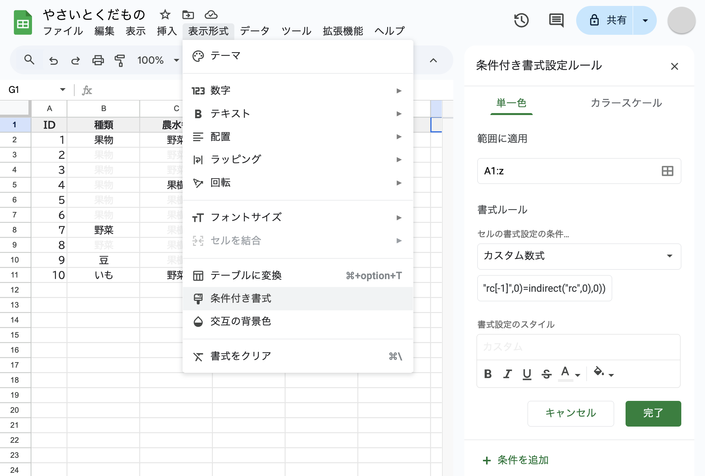
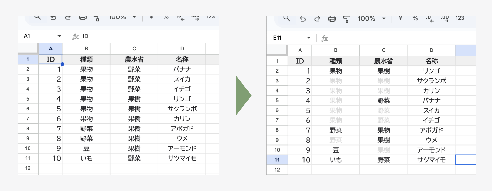
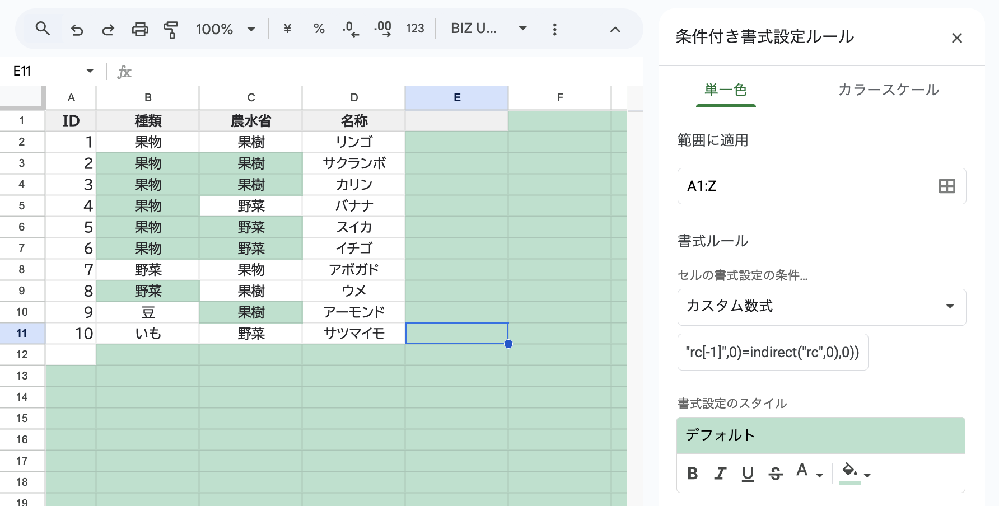
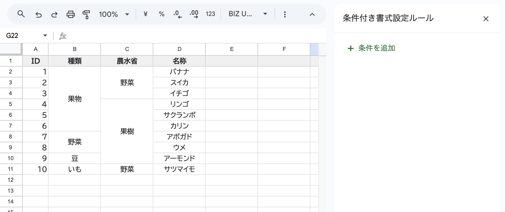

## 概要
スプレッドシートにおいて隣り合ったセルが同じテキストであるような場合に、セル結合を使わずに、条件付き書式を用いて視覚的にグルーピングする方法を紹介します。
この方法は第1正規形を維持したまま、データの可読性を向上させることができます。
### コード
```formula wrap
=or(iferror(indirect("r[-1]c",0)=indirect("rc",0),0),iferror(indirect("rc[-1]",0)=indirect("rc",0),0))
```
### 適用場所

1. 条件付き書式を適用したい範囲を選択
2. 「表示形式」→「条件付き書式」を選択
3. 「カスタム数式」を選択し、上記の数式を入力
4. 文字色など、希望の書式スタイルを設定
### 期待される変化

- 同じ値が連続するセルのうち、2番目以降のセルが自動的に書式設定される
- データの構造を保ったまま、視覚的なグルーピングが可能
- セル結合と異なり、データの編集や並び替えが自由に行える
## 関数の解説
条件付き書式で使用している数式を詳しく解説します。
### R1C1参照形式の解説
```formula
indirect("r[-1]c",0) // 上のセル 
indirect("rc[-1]",0) // 左のセル
```
`r[-1]c`のような表記はR1C1参照形式と呼ばれ、現在のセルからの相対的な位置を指定します：
- `r[-1]`: 現在の行から1つ上
- `c[-1]`: 現在の列から1つ左
- `c / c[0]` または `r / r[0]`: 現在の位置

そして`indirect`関数でこの位置表現を実際のセル参照に変換しています。
### 条件式の仕組み
```formula
=or(
  iferror(indirect("r[-1]c",0)=indirect("rc",0),0),  // ①上のセルと同じか
  iferror(indirect("rc[-1]",0)=indirect("rc",0),0)   // ②左のセルと同じか
)
```

| 関数                 | 説明                         |
| ------------------ | -------------------------- |
| `or(...)`          | ①または②の条件が真なら書式を適用          |
| `iferror(...,0)`   | 端のセルでエラーになる場合は`false`として扱う |
| `indirect("rc",0)` | 現在のセルの値                    |
この数式により以下の結果が得られます：
- 上または左のセルと同じ値なら`true`
- それ以外なら`false`
- セルの端（一番上や一番左）ではエラーを防ぐ

## 背景：なぜこの方法が必要か

### 第1正規形とは
データベースの設計原則の1つで「1つのセル(フィールド)に1つの値のみを持つ」という形式です。
この形式に従うことで、データの検索や集計が容易になります。またプログラムや機械がデータを扱うためには、第1正規形を満たしている必要があります。さもないと人が手でデータを修正することになります。
### セル結合

セル結合された表は一見読みやすく見えますが、以下のような問題があります：
- データの追加・編集が面倒
	- 新しい行を追加する際に「結合を解除→追加→再結合」が必要
	- 並び替えを行う際にも結合の解除が必要
- プログラムでの処理が困難
	- APIやツールでデータを取り込む際に正しく読み取れない
	- 自動化スクリプトが正常に動作しない

セル結合された表は、もちろん機械は扱えませんし、人間にとっても扱いづらい形なのです。
### 機械可読性の重要性
総務省が発行している[統計表における機械判読可能なデータ作成に関する表記方法について](https://www.soumu.go.jp/main_content/000723697.pdf)では、機械判読可能なデータ作成のガイドラインとして以下の取扱いが推奨されています：
- セルの結合をしていないか
- １セル１データとなっているか
- 項⽬名等を省略していないか

このガイドラインからも、データの作成と表示において視覚的にまとまりを出す要求があり、そのためににセル結合が使われている実態と、しかしデータの長期的な活用やシステム連携を考える上でセル結合は避ける必要があるということが確認できます。
### 従来の代替手法とその限界
これまで「選択範囲内で中央」 [^1] [^2] [^3] という手法が提案されてきましたが、以下の問題がありました：
1. **操作の手間**
	- 範囲選択が必要
	- 書式設定を手動で行う必要がある
2. **データの信頼性**
	- 選択範囲の下に隠れるセルの値が保証されない
	- 範囲選択を誤ると表示が崩れる
4. **メンテナンスの困難さ**
	- データ更新の度に再設定が必要
	- 他のユーザーとの共有時に設定が引き継がれない場合がある
## 参考
- [統計表における機械判読可能なデータ作成に関する表記方法について (統計企画会議申合せ)](https://www.soumu.go.jp/main_content/000723697.pdf)
- [Excel 上のセルと同じ値なら表示しない方法 | ITメモ](https://itmemo123.net/office/629/)
- [野菜の定義について, 独立行政法人 農畜産業振興機構](https://www.alic.go.jp/content/000093223.pdf)

[^1]: [構造化Excelテク：セルの結合を使わずに複数セルの中央に文字列を表示する：Tech TIPS - ＠IT](https://atmarkit.itmedia.co.jp/ait/articles/2108/23/news016.html)
[^2]: [【Excel】セルの結合は避けるべき？それでも複数セルの中央に文字列を表示させるエクセルのテクニック - いまさら聞けないExcelの使い方講座 - 窓の杜](https://forest.watch.impress.co.jp/docs/serial/exceltips/1109032.html)
[^3]: [セルを結合せずに文字を中央に表示したい｜中小企業ソリューション｜キヤノン](https://canon.jp/business/solution/smb/tips/excel/invoice/03)